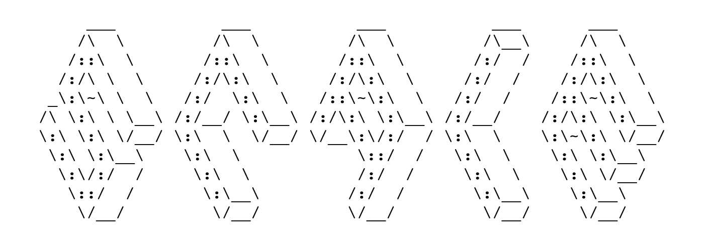

> Please note that we currently moved development into a private repository for corporate reasons, we hope we can come back and work on our public version again soon! Thank you for your support and feedback.



The `scale` library offers a set of customizable UI components written in `TypeScript`. The default `theme` of the library can be easily replaced so that a corresponding corporate identity of a dedicated brand can be represented.

   

## Scale Monorepo

### Setup

This repository uses `lerna` and `typescript`

### Running locally

#### 1. Clone this repository to a local folder of your choice

```bash
cd path-to/folder-name
git clone git@github.com:telekom/scale.git
cd scale
```

#### 2. Install dependencies

This repository uses `yarn lerna`, for the symlinks to work correctly we use `yarn` in favour of `npm`

```bash
yarn bootstrap
```

#### 3. Build packages

```bash
# build
yarn build
```

#### 4. Local development

```bash
# components
cd packages/components
yarn start
```

### Contributing

We strongly recommend that the community help us make improvements and determine the future direction of the library. To report bugs within this package, please create an issue in this repository.


##### Development Tooling

We strongly recommend you use the `VSCode text editor` since most of our code is written in `Typescript` and it offers amazing support for the language.
