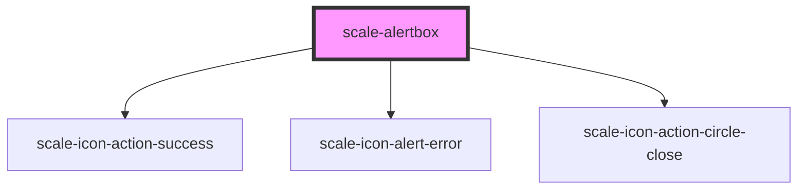

# scale-alertbox

<!-- Auto Generated Below -->

## Properties

| Property   | Attribute  | Description | Type                            | Default     |
| ---------- | ---------- | ----------- | ------------------------------- | ----------- |
| `color`    | `color`    |             | `"black" \| "error" \| "white"` | `'white'`   |
| `hasclose` | `hasclose` |             | `boolean`                       | `false`     |
| `icon`     | `icon`     |             | `boolean`                       | `false`     |
| `opened`   | `opened`   |             | `boolean`                       | `undefined` |
| `timeout`  | `timeout`  |             | `boolean \| number`             | `false`     |
| `variant`  | `variant`  |             | `"floating" \| "outline"`       | `undefined` |

## Shadow Parts

| Part          | Description |
| ------------- | ----------- |
| `"container"` |             |
| `"content"`   |             |
| `"header"`    |             |

## Dependencies

### Depends on

- [scale-icon-action-success](../icons/action-success)
- [scale-icon-alert-error](../icons/alert-error)
- [scale-icon-action-circle-close](../icons/action-circle-close)

### Graph

----------------------------------------------

*Built with [StencilJS](https://stenciljs.com/)*
