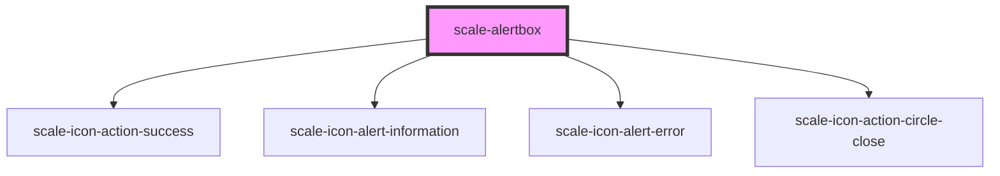

# scale-alertbox

<!-- Auto Generated Below -->

## Properties

| Property          | Attribute          | Description                           | Type                                                   | Default           |
| ----------------- | ------------------ | ------------------------------------- | ------------------------------------------------------ | ----------------- |
| `ariaDescription` | `aria-description` | (optional) aria-description attribute | `string`                                               | `undefined`       |
| `ariaLabel`       | `aria-label`       | (optional) aria-label attribute       | `string`                                               | `undefined`       |
| `hasClose`        | `has-close`        |                                       | `boolean`                                              | `false`           |
| `opened`          | `opened`           |                                       | `boolean`                                              | `undefined`       |
| `timeout`         | `timeout`          |                                       | `boolean \| number`                                    | `false`           |
| `variant`         | `variant`          |                                       | `"error" \| "informational" \| "success" \| "warning"` | `'informational'` |

## Methods

### `open() => Promise<void>`

Alert method: open()

#### Returns

Type: `Promise<void>`

## Shadow Parts

| Part          | Description |
| ------------- | ----------- |
| `"container"` |             |
| `"content"`   |             |
| `"header"`    |             |

## Dependencies

### Depends on

- [scale-icon-action-success](../icons/action-success)
- [scale-icon-alert-information](../icons/alert-information)
- [scale-icon-alert-error](../icons/alert-error)
- [scale-icon-action-circle-close](../icons/action-circle-close)

### Graph

----------------------------------------------

*Built with [StencilJS](https://stenciljs.com/)*
