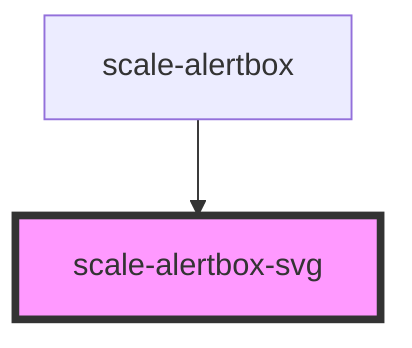

# scale-alertbox

<!-- Auto Generated Below -->

## Properties

| Property             | Attribute             | Description                                                                     | Type              | Default     |
| -------------------- | --------------------- | ------------------------------------------------------------------------------- | ----------------- | ----------- |
| `accessibilityTitle` | `accessibility-title` | (optional) When using the icon standalone, make it meaningful for accessibility | `string`          | `undefined` |
| `color`              | `color`               | (optional) Sets the icon color via the `fill` attribute                         | `string`          | `'magenta'` |
| `role`               | `role`                |                                                                                 | `"img" \| "link"` | `'img'`     |
| `size`               | `size`                | (optional) The height in pixels                                                 | `number`          | `36`        |

## Dependencies

### Used by

 - [scale-alertbox](.)

### Graph

----------------------------------------------

*Built with [StencilJS](https://stenciljs.com/)*
