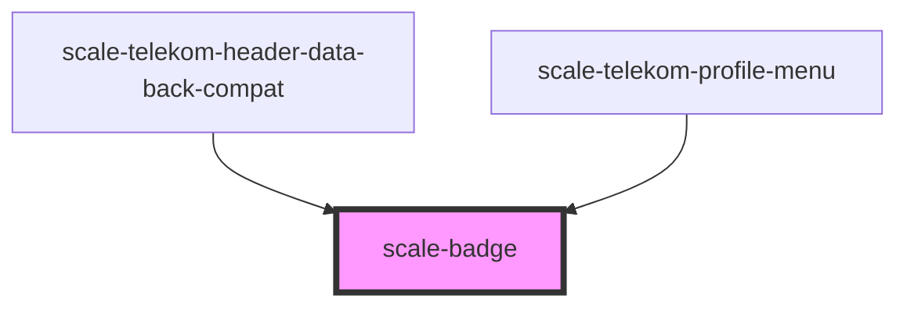

# scale-badge

<!-- Auto Generated Below -->

## Properties

| Property               | Attribute                | Description                             | Type      | Default                  |
| ---------------------- | ------------------------ | --------------------------------------- | --------- | ------------------------ |
| `ariaLabelTranslation` | `aria-label-translation` | a11y text for getting meaningful value. | `string`  | `'$label - $count item'` |
| `count`                | `count`                  |                                         | `number`  | `undefined`              |
| `label`                | `label`                  |                                         | `string`  | `undefined`              |
| `labelVisuallyHidden`  | `label-visually-hidden`  |                                         | `boolean` | `undefined`              |

## Shadow Parts

| Part                | Description |
| ------------------- | ----------- |
| `"base"`            |             |
| `"visually-hidden"` |             |

## Dependencies

### Used by

 - [scale-telekom-header-data-back-compat](../telekom/telekom-header-data-back-compat)
 - [scale-telekom-profile-menu](../telekom/telekom-profile-menu)

### Graph

----------------------------------------------

*Built with [StencilJS](https://stenciljs.com/)*
