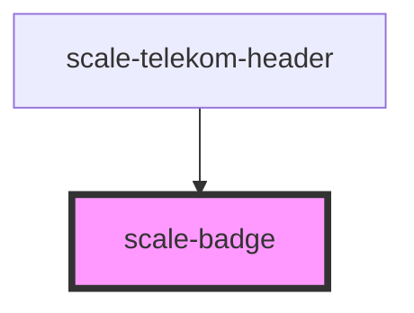

# scale-badge

<!-- Auto Generated Below -->

## Properties

| Property              | Attribute               | Description | Type      | Default     |
| --------------------- | ----------------------- | ----------- | --------- | ----------- |
| `count`               | `count`                 |             | `number`  | `undefined` |
| `label`               | `label`                 |             | `string`  | `undefined` |
| `labelVisuallyHidden` | `label-visually-hidden` |             | `boolean` | `undefined` |

## Shadow Parts

| Part                | Description |
| ------------------- | ----------- |
| `"base"`            |             |
| `"visually-hidden"` |             |

## Dependencies

### Used by

 - [scale-telekom-header](../telekom/telekom-header)

### Graph

----------------------------------------------

*Built with [StencilJS](https://stenciljs.com/)*
