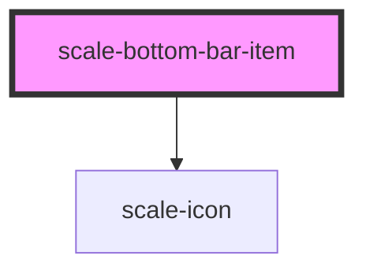

# scale-bottom-bar-item

<!-- Auto Generated Below -->

## Properties

| Property   | Attribute  | Description                    | Type      | Default     |
| ---------- | ---------- | ------------------------------ | --------- | ----------- |
| `icon`     | `icon`     | (optional) Icon label          | `string`  | `undefined` |
| `label`    | `label`    | (optional) Icon label          | `string`  | `undefined` |
| `selected` | `selected` | (optional) Selected state      | `boolean` | `false`     |
| `styles`   | `styles`   | (optional) Injected CSS styles | `string`  | `undefined` |

## Dependencies

### Depends on

- [scale-icon](../icon)

### Graph

----------------------------------------------

*Built with [StencilJS](https://stenciljs.com/)*
