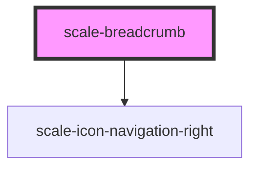

# scale-breadcrumb

<!-- Auto Generated Below -->

## Properties

| Property    | Attribute   | Description                    | Type     | Default     |
| ----------- | ----------- | ------------------------------ | -------- | ----------- |
| `separator` | `separator` |                                | `string` | `undefined` |
| `styles`    | `styles`    | (optional) Injected CSS styles | `string` | `undefined` |

## Shadow Parts

| Part          | Description |
| ------------- | ----------- |
| `"base"`      |             |
| `"list"`      |             |
| `"list-item"` |             |
| `"separator"` |             |

## Dependencies

### Depends on

- [scale-icon-navigation-right](../icons/navigation-right)

### Graph

----------------------------------------------

*Built with [StencilJS](https://stenciljs.com/)*
