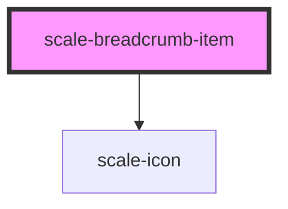

# scale-breadcrumb

<!-- Auto Generated Below -->

## Properties

| Property    | Attribute   | Description                    | Type                                     | Default                                                                                                                                                             |
| ----------- | ----------- | ------------------------------ | ---------------------------------------- | ------------------------------------------------------------------------------------------------------------------------------------------------------------------- |
| `current`   | `current`   |                                | `boolean`                                | `false`                                                                                                                                                             |
| `height`    | `height`    |                                | `number`                                 | `19`                                                                                                                                                                |
| `href`      | `href`      |                                | `string`                                 | `undefined`                                                                                                                                                         |
| `path`      | `path`      |                                | `string`                                 | `'M.793 17.947a1 1 0 01-.058-1.35l.058-.064 7.414-7.411L.793 1.707A1 1 0 01.734.357L.793.293a1 1 0 011.35-.059l.064.059 8.828 8.828-8.828 8.826a1 1 0 01-1.414 0z'` |
| `separator` | `separator` |                                | `string`                                 | `undefined`                                                                                                                                                         |
| `size`      | `size`      |                                | `number`                                 | `undefined`                                                                                                                                                         |
| `styles`    | --          | (optional) Injected jss styles | `StyleSheet<string \| number \| symbol>` | `undefined`                                                                                                                                                         |
| `width`     | `width`     |                                | `number`                                 | `11`                                                                                                                                                                |

## Dependencies

### Depends on

- [scale-icon](../icon)

### Graph

----------------------------------------------

*Built with [StencilJS](https://stenciljs.com/)*
