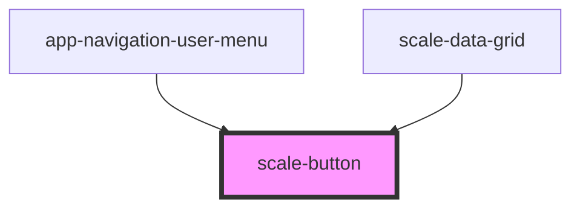

# scale-button

<!-- Auto Generated Below -->

## Properties

| Property       | Attribute       | Description                                                    | Type                              | Default     |
| -------------- | --------------- | -------------------------------------------------------------- | --------------------------------- | ----------- |
| `ariaLabel`    | `aria-label`    | (optional) aria-label attribute needed for icon-only buttons   | `string`                          | `undefined` |
| `disabled`     | `disabled`      | (optional) If `true`, the button is disabled                   | `boolean`                         | `false`     |
| `download`     | `download`      | (optional) If `true`, a download is triggrered                 | `boolean`                         | `false`     |
| `href`         | `href`          | (optional) When present, an <a> tag will be used               | `string`                          | `undefined` |
| `iconOnly`     | `icon-only`     | (optional) Set to `true` when the button contains only an icon | `boolean`                         | `false`     |
| `iconPosition` | `icon-position` | (optional) Icon position related to the label                  | `"after" \| "before"`             | `'before'`  |
| `size`         | `size`          | (optional) The size of the button                              | `"large" \| "small"`              | `'large'`   |
| `styles`       | `styles`        | (optional) Injected CSS styles                                 | `string`                          | `undefined` |
| `target`       | `target`        | (optional) The target attribute for the <a> tag                | `string`                          | `'_self'`   |
| `type`         | `type`          | (optional) Button type                                         | `"button" \| "reset" \| "submit"` | `undefined` |
| `variant`      | `variant`       | (optional) Button variant                                      | `string`                          | `'primary'` |

## Dependencies

### Used by

 - [app-navigation-user-menu](../telekom/app-navigation-user-menu)
 - [scale-data-grid](../data-grid)

### Graph

----------------------------------------------

*Built with [StencilJS](https://stenciljs.com/)*
