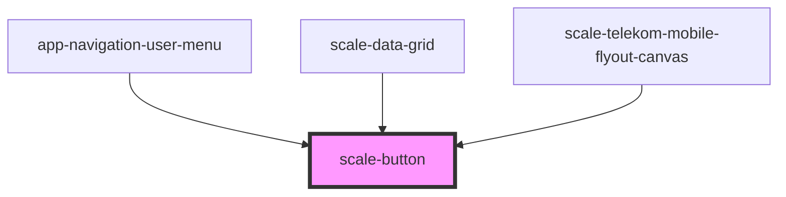

# scale-button

<!-- Auto Generated Below -->

## Properties

| Property         | Attribute          | Description                                                                                               | Type                              | Default     |
| ---------------- | ------------------ | --------------------------------------------------------------------------------------------------------- | --------------------------------- | ----------- |
| `disabled`       | `disabled`         | (optional) If `true`, the button is disabled                                                              | `boolean`                         | `false`     |
| `download`       | `download`         | (optional) Name of a file to be downloaded                                                                | `string`                          | `undefined` |
| `href`           | `href`             | (optional) When present, an <a> tag will be used                                                          | `string`                          | `undefined` |
| `iconOnly`       | `icon-only`        | (optional) Set to `true` when the button contains only an icon                                            | `boolean`                         | `false`     |
| `iconPosition`   | `icon-position`    | (optional) Icon position related to the label                                                             | `"after" \| "before"`             | `'before'`  |
| `innerAriaLabel` | `inner-aria-label` | (optional) Button aria-label                                                                              | `string`                          | `undefined` |
| `innerTabindex`  | `inner-tabindex`   | (optional) Set `tabindex` in the inner button or link element                                             | `number`                          | `undefined` |
| `name`           | `name`             | (optional) The name of the button, submitted as a pair with the button's `value` as part of the form data | `string`                          | `undefined` |
| `size`           | `size`             | (optional) The size of the button                                                                         | `"large" \| "small"`              | `'large'`   |
| `styles`         | `styles`           | (optional) Injected CSS styles                                                                            | `string`                          | `undefined` |
| `target`         | `target`           | (optional) The target attribute for the <a> tag                                                           | `string`                          | `'_self'`   |
| `type`           | `type`             | (optional) Button type                                                                                    | `"button" \| "reset" \| "submit"` | `undefined` |
| `value`          | `value`            | (optional) Defines the value associated with the button's `name`                                          | `string`                          | `undefined` |
| `variant`        | `variant`          | (optional) Button variant                                                                                 | `string`                          | `'primary'` |

## Methods

### `setFocus() => Promise<void>`

#### Returns

Type: `Promise<void>`

## Dependencies

### Used by

 - [app-navigation-user-menu](../telekom/app-navigation-user-menu)
 - [scale-data-grid](../data-grid)
 - [scale-telekom-mobile-flyout-canvas](../telekom/telekom-mobile-flyout-canvas)

### Graph

----------------------------------------------

*Built with [StencilJS](https://stenciljs.com/)*
