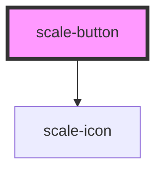

# scale-button

<!-- Auto Generated Below -->

## Properties

| Property      | Attribute      | Description                    | Type                                     | Default     |
| ------------- | -------------- | ------------------------------ | ---------------------------------------- | ----------- |
| `ariaLabel`   | `aria-label`   |                                | `string`                                 | `''`        |
| `customClass` | `custom-class` | (optional) Button class        | `string`                                 | `''`        |
| `disabled`    | `disabled`     | (optional) Disabled button     | `boolean`                                | `false`     |
| `focusable`   | `focusable`    |                                | `boolean`                                | `true`      |
| `href`        | `href`         | (optional) Link button         | `string`                                 | `''`        |
| `icon`        | `icon`         | (optional) Icon only           | `string`                                 | `undefined` |
| `iconAfter`   | `icon-after`   | (optional) Icon after          | `string`                                 | `undefined` |
| `iconBefore`  | `icon-before`  | (optional) Icon before         | `string`                                 | `undefined` |
| `iconSize`    | `icon-size`    | (optional) Icon only           | `number`                                 | `24`        |
| `role`        | `role`         |                                | `string`                                 | `''`        |
| `size`        | `size`         | (optional) Button size         | `string`                                 | `''`        |
| `styles`      | --             | (optional) Injected jss styles | `StyleSheet<string \| number \| symbol>` | `undefined` |
| `target`      | `target`       | (optional) Link target button  | `string`                                 | `'_self'`   |
| `variant`     | `variant`      | (optional) Button variant      | `string`                                 | `''`        |

## Methods

### `disable() => Promise<void>`

Button method: disable()

#### Returns

Type: `Promise<void>`

### `enable() => Promise<void>`

Button method: enable()

#### Returns

Type: `Promise<void>`

## Dependencies

### Depends on

- [scale-icon](../icon)

### Graph

----------------------------------------------

*Built with [StencilJS](https://stenciljs.com/)*
