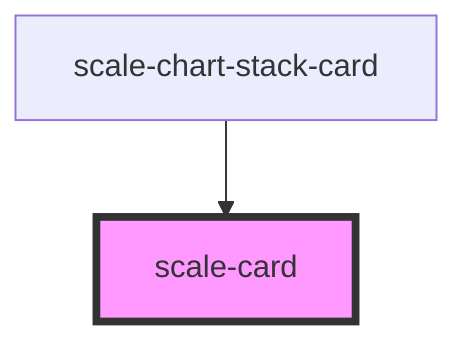

# scale-card

<!-- Auto Generated Below -->

## Usage

### Card

# Default

<scale-card>
  <h1>Card Title</h1>
  
This is card content

</scale-card>

### Card-interactive

### Interactive

<scale-card href="http://example.com" target="_blank">
  
click me

</scale-card>

## Properties

| Property  | Attribute | Description                       | Type      | Default   |
| --------- | --------- | --------------------------------- | --------- | --------- |
| `label`   | `label`   | (optional) Label of the card      | `string`  | `''`      |
| `movable` | `movable` | (optional) Supports drag and drop | `boolean` | `false`   |
| `rel`     | `rel`     | (optional) Link card rel          | `string`  | `''`      |
| `target`  | `target`  | (optional) Link card target       | `string`  | `'_self'` |
| `to`      | `to`      | (optional) Link card              | `string`  | `''`      |

## Shadow Parts

| Part       | Description |
| ---------- | ----------- |
| `"body"`   |             |
| `"border"` |             |

## Dependencies

### Used by

 - [scale-chart-stack-card](../chart-stack-card)

### Graph

----------------------------------------------

*Built with [StencilJS](https://stenciljs.com/)*
