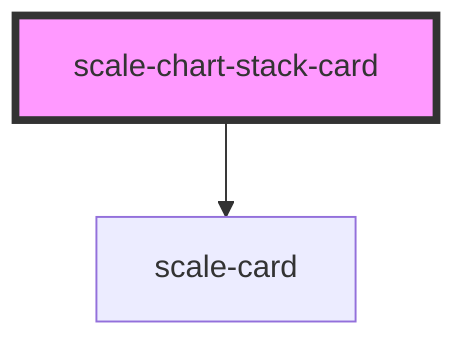

# scale-chart-stack-card

<!-- Auto Generated Below -->

## Properties

| Property  | Attribute | Description                                                          | Type                                 | Default     |
| --------- | --------- | -------------------------------------------------------------------- | ------------------------------------ | ----------- |
| `data`    | `data`    | Chart Data (`[{ type: string, value: string, percentage: string }]`) | `ChartStackCardDataItem[] \| string` | `undefined` |
| `heading` | `heading` | Chart Title                                                          | `string`                             | `undefined` |

## Dependencies

### Depends on

- [scale-card](../card)

### Graph

----------------------------------------------

*Built with [StencilJS](https://stenciljs.com/)*
