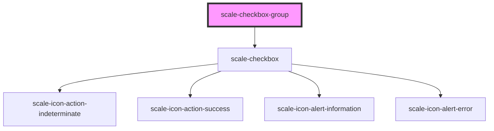

# scale-checkbox-group

<!-- Auto Generated Below -->

## Properties

| Property                 | Attribute                   | Description                                                                                                 | Type      | Default          |
| ------------------------ | --------------------------- | ----------------------------------------------------------------------------------------------------------- | --------- | ---------------- |
| `ariaLabelCheckboxGroup` | `aria-label-checkbox-group` | **[DEPRECATED]** - ariaLabelCheckboxGroup should replace ariaLabel   | `string`  | `undefined`      |
| `helperText`             | `helper-text`               | (optional) Input helper text                                                                                | `string`  | `undefined`      |
| `inputId`                | `input-id`                  | (optional) Input checkbox id                                                                                | `string`  | `undefined`      |
| `invalid`                | `invalid`                   | (optional) Input status                                                                                     | `boolean` | `false`          |
| `label`                  | `label`                     | (optional) Input label                                                                                      | `string`  | `''`             |
| `name`                   | `name`                      | (optional) Input name                                                                                       | `string`  | `undefined`      |
| `selectText`             | `select-text`               |                                                                                                             | `string`  | `'Select all'`   |
| `status`                 | `status`                    | **[DEPRECATED]** - invalid should replace status                     | `string`  | `''`             |
| `styles`                 | `styles`                    | (optional) Injected CSS styles                                                                              | `string`  | `undefined`      |
| `unselectText`           | `unselect-text`             |                                                                                                             | `string`  | `'Unselect all'` |
| `value`                  | `value`                     | (optional) Input value                                                                                      | `string`  | `''`             |

## Shadow Parts

| Part                | Description |
| ------------------- | ----------- |
| `"fieldset"`        |             |
| `"parent-checkbox"` |             |

## Dependencies

### Depends on

- [scale-checkbox](../checkbox)

### Graph

----------------------------------------------

*Built with [StencilJS](https://stenciljs.com/)*
