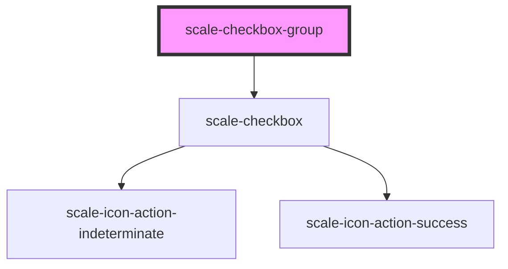

# scale-checkbox-group

<!-- Auto Generated Below -->

## Properties

| Property       | Attribute       | Description                    | Type     | Default          |
| -------------- | --------------- | ------------------------------ | -------- | ---------------- |
| `ariaLabel`    | `aria-label`    | (optional) Input label output  | `string` | `undefined`      |
| `helperText`   | `helper-text`   | (optional) Input helper text   | `string` | `undefined`      |
| `inputId`      | `input-id`      | (optional) Input checkbox id   | `string` | `undefined`      |
| `label`        | `label`         | (optional) Input label         | `string` | `''`             |
| `name`         | `name`          | (optional) Input name          | `string` | `undefined`      |
| `selectText`   | `select-text`   |                                | `string` | `'Select all'`   |
| `status`       | `status`        | (optional) Input status        | `string` | `''`             |
| `styles`       | `styles`        | (optional) Injected CSS styles | `string` | `undefined`      |
| `unselectText` | `unselect-text` |                                | `string` | `'Unselect all'` |
| `value`        | `value`         | (optional) Input value         | `string` | `''`             |

## Shadow Parts

| Part         | Description |
| ------------ | ----------- |
| `"fieldset"` |             |

## Dependencies

### Depends on

- [scale-checkbox](../checkbox)

### Graph

----------------------------------------------

*Built with [StencilJS](https://stenciljs.com/)*
