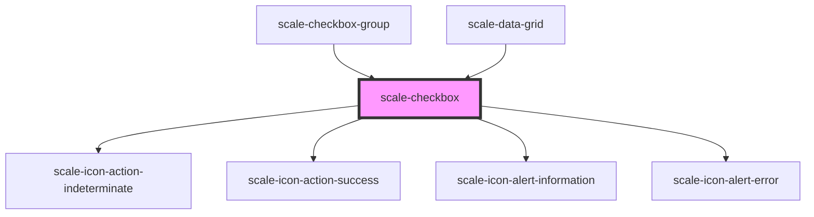

# scale-checkbox

<!-- Auto Generated Below -->

## Properties

| Property            | Attribute             | Description                                                                               | Type      | Default     |
| ------------------- | --------------------- | ----------------------------------------------------------------------------------------- | --------- | ----------- |
| `ariaLabelCheckbox` | `aria-label-checkbox` | (optional) Input label output                                                             | `string`  | `undefined` |
| `checked`           | `checked`             | (optional) Active switch                                                                  | `boolean` | `false`     |
| `disabled`          | `disabled`            | (optional) Input disabled                                                                 | `boolean` | `false`     |
| `helperText`        | `helper-text`         | (optional) Input helper text                                                              | `string`  | `undefined` |
| `hideLabel`         | `hide-label`          | (optional) Hides the specified label visually                                             | `boolean` | `false`     |
| `indeterminate`     | `indeterminate`       | (optional) indeterminate                                                                  | `boolean` | `false`     |
| `inputId`           | `input-id`            | (optional) Input checkbox id                                                              | `string`  | `undefined` |
| `invalid`           | `invalid`             | (optional) Input status                                                                   | `boolean` | `false`     |
| `label`             | `label`               | (optional) Input label                                                                    | `string`  | `''`        |
| `name`              | `name`                | (optional) Input name                                                                     | `string`  | `undefined` |
| `required`          | `required`            | (optional) Input required                                                                 | `boolean` | `undefined` |
| `status`            | `status`              | **[DEPRECATED]** - invalid should replace status   | `string`  | `''`        |
| `styles`            | `styles`              | (optional) Injected CSS styles                                                            | `string`  | `undefined` |
| `value`             | `value`               | (optional) Input value                                                                    | `string`  | `''`        |

## Events

| Event          | Description                                                                                        | Type               |
| -------------- | -------------------------------------------------------------------------------------------------- | ------------------ |
| `scale-change` | Emitted when the value has changed.                                                                | `CustomEvent<any>` |
| `scaleChange`  | **[DEPRECATED]** in v3 in favor of kebab-case event names   | `CustomEvent<any>` |

## Shadow Parts

| Part            | Description |
| --------------- | ----------- |
| `"checkbox"`    |             |
| `"container"`   |             |
| `"helper-text"` |             |
| `"icon"`        |             |
| `"input"`       |             |
| `"label"`       |             |

## Dependencies

### Used by

 - [scale-checkbox-group](../checkbox-group)
 - [scale-data-grid](../data-grid)

### Depends on

- [scale-icon-action-indeterminate](../icons/action-indeterminate)
- [scale-icon-action-success](../icons/action-success)
- [scale-icon-alert-information](../icons/alert-information)
- [scale-icon-alert-error](../icons/alert-error)

### Graph

----------------------------------------------

*Built with [StencilJS](https://stenciljs.com/)*
