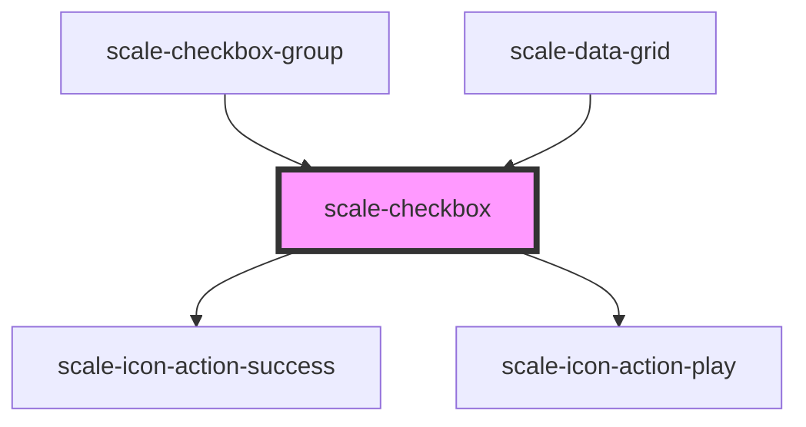

# scale-checkbox

<!-- Auto Generated Below -->

## Properties

| Property         | Attribute        | Description                    | Type               | Default     |
| ---------------- | ---------------- | ------------------------------ | ------------------ | ----------- |
| `checked`        | `checked`        | (optional) Active switch       | `boolean`          | `false`     |
| `disabled`       | `disabled`       | (optional) Input disabled      | `boolean`          | `undefined` |
| `helperText`     | `helper-text`    | (optional) Input helper text   | `string`           | `''`        |
| `indeterminated` | `indeterminated` | (optional) indeterminated      | `boolean`          | `false`     |
| `inputId`        | `input-id`       | (optional) Input checkbox id   | `string`           | `undefined` |
| `label`          | `label`          | (optional) Input label         | `string`           | `''`        |
| `name`           | `name`           | (optional) Input name          | `string`           | `''`        |
| `status`         | `status`         | (optional) Input status        | `string`           | `''`        |
| `styles`         | `styles`         | (optional) Injected CSS styles | `string`           | `undefined` |
| `value`          | `value`          | (optional) Input value         | `number \| string` | `''`        |

## Events

| Event         | Description                         | Type               |
| ------------- | ----------------------------------- | ------------------ |
| `scaleChange` | Emitted when the value has changed. | `CustomEvent<any>` |

## Dependencies

### Used by

 - [scale-checkbox-group](../checkbox-group)
 - [scale-data-grid](../data-grid)

### Depends on

- [scale-icon-action-success](../icons/action-success)
- [scale-icon-action-play](../icons/action-play)

### Graph

----------------------------------------------

*Built with [StencilJS](https://stenciljs.com/)*
