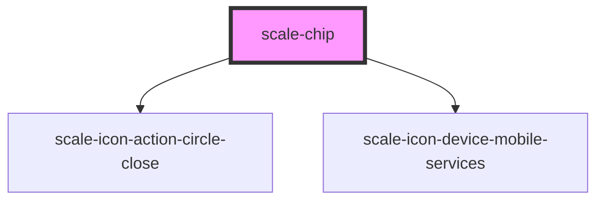

# scale-chip

<!-- Auto Generated Below -->

## Properties

| Property      | Attribute     | Description                    | Type                                | Default     |
| ------------- | ------------- | ------------------------------ | ----------------------------------- | ----------- |
| `color`       | `color`       | (optional) Chip color          | `"black" \| "default" \| "magenta"` | `'default'` |
| `disabled`    | `disabled`    | (optional) Chip disabled       | `boolean`                           | `false`     |
| `dismissable` | `dismissable` | (optional) Chip dismissable    | `boolean`                           | `false`     |
| `href`        | `href`        | (optional) Chip href           | `string`                            | `''`        |
| `iconOnly`    | `icon-only`   | (optional) Chip icon only      | `boolean`                           | `false`     |
| `styles`      | `styles`      | (optional) Injected CSS styles | `string`                            | `undefined` |
| `target`      | `target`      | (optional) Chip target         | `string`                            | `'_self'`   |

## Events

| Event         | Description                                                                                        | Type                      |
| ------------- | -------------------------------------------------------------------------------------------------- | ------------------------- |
| `scale-close` | (optional) Close icon click event                                                                  | `CustomEvent<MouseEvent>` |
| `scaleClose`  | **[DEPRECATED]** in v3 in favor of kebab-case event names   | `CustomEvent<MouseEvent>` |

## Dependencies

### Depends on

- [scale-icon-action-circle-close](../icons/action-circle-close)
- [scale-icon-device-mobile-services](../icons/device-mobile-services)

### Graph

----------------------------------------------

*Built with [StencilJS](https://stenciljs.com/)*
