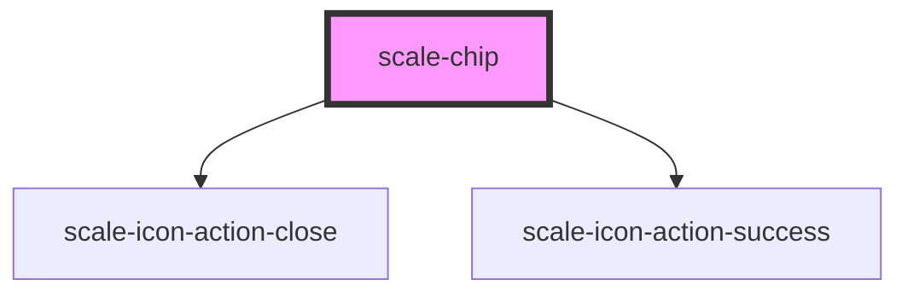

# scale-chip

<!-- Auto Generated Below -->

## Properties

| Property           | Attribute            | Description                    | Type                                                                                                                  | Default      |
| ------------------ | -------------------- | ------------------------------ | --------------------------------------------------------------------------------------------------------------------- | ------------ |
| `ariaCheckedState` | `aria-checked-state` | (optional) chip aria-checked   | `boolean`                                                                                                             | `undefined`  |
| `ariaRoleTitle`    | `aria-role-title`    | (optional) chip aria-role      | `string`                                                                                                              | `'switch'`   |
| `color`            | `color`              | (optional) chip color          | `"black" \| "brown" \| "cyan" \| "green" \| "grey" \| "olive" \| "orange" \| "red" \| "teal" \| "violet" \| "yellow"` | `undefined`  |
| `disabled`         | `disabled`           | (optional) chip disabled       | `boolean`                                                                                                             | `false`      |
| `dismissible`      | `dismissible`        | (optional) chip dismissible    | `boolean`                                                                                                             | `false`      |
| `iconSize`         | `icon-size`          | (optional) chip icon size      | `number`                                                                                                              | `16`         |
| `label`            | `label`              | (optional) chip label          | `string`                                                                                                              | `undefined`  |
| `selected`         | `selected`           | (optional)                     | `boolean`                                                                                                             | `false`      |
| `styles`           | `styles`             | (optional) Injected CSS styles | `string`                                                                                                              | `undefined`  |
| `type`             | `type`               | (optional) chip type           | `"standard" \| "strong"`                                                                                              | `'standard'` |

## Events

| Event          | Description                                                                                        | Type                      |
| -------------- | -------------------------------------------------------------------------------------------------- | ------------------------- |
| `scale-change` | (optional) Change icon click event                                                                 | `CustomEvent<MouseEvent>` |
| `scale-close`  | (optional) Close icon click event                                                                  | `CustomEvent<MouseEvent>` |
| `scaleChange`  | **[DEPRECATED]** in v3 in favor of kebab-case event names   | `CustomEvent<MouseEvent>` |
| `scaleClose`   | **[DEPRECATED]** in v3 in favor of kebab-case event names   | `CustomEvent<MouseEvent>` |

## Dependencies

### Depends on

- [scale-icon-action-close](../icons/action-close)
- [scale-icon-action-success](../icons/action-success)

### Graph

----------------------------------------------

*Built with [StencilJS](https://stenciljs.com/)*
