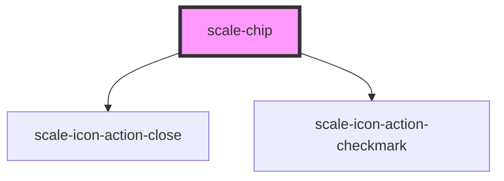

# scale-chip

<!-- Auto Generated Below -->

## Properties

| Property           | Attribute            | Description                    | Type                        | Default        |
| ------------------ | -------------------- | ------------------------------ | --------------------------- | -------------- |
| `ariaCheckedState` | `aria-checked-state` | (optional) chip aria-checked   | `boolean`                   | `undefined`    |
| `ariaRoleTitle`    | `aria-role-title`    | (optional) chip aria-role      | `string`                    | `undefined`    |
| `disabled`         | `disabled`           | (optional) chip disabled       | `boolean`                   | `false`        |
| `dismissText`      | `dismiss-text`       | (optional) Dismiss label       | `string`                    | `'dismiss'`    |
| `label`            | `label`              | (optional) chip label          | `string`                    | `undefined`    |
| `selected`         | `selected`           | (optional)                     | `boolean`                   | `false`        |
| `styles`           | `styles`             | (optional) Injected CSS styles | `string`                    | `undefined`    |
| `type`             | `type`               | (optional)                     | `"dynamic" \| "persistent"` | `'persistent'` |
| `variant`          | `variant`            | (optional)                     | `"outline" \| "standard"`   | `'standard'`   |

## Events

| Event          | Description                                                                                        | Type                      |
| -------------- | -------------------------------------------------------------------------------------------------- | ------------------------- |
| `scale-change` | (optional) Change icon click event                                                                 | `CustomEvent<MouseEvent>` |
| `scale-close`  | (optional) Close icon click event                                                                  | `CustomEvent<MouseEvent>` |
| `scaleChange`  | **[DEPRECATED]** in v3 in favor of kebab-case event names   | `CustomEvent<MouseEvent>` |
| `scaleClose`   | **[DEPRECATED]** in v3 in favor of kebab-case event names   | `CustomEvent<MouseEvent>` |

## Shadow Parts

| Part                   | Description |
| ---------------------- | ----------- |
| `"button-dismissable"` |             |

## Dependencies

### Depends on

- [scale-icon-action-close](../icons/action-close)
- [scale-icon-action-checkmark](../icons/action-checkmark)

### Graph

----------------------------------------------

*Built with [StencilJS](https://stenciljs.com/)*
