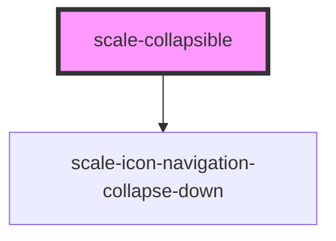

# scale-collapsible

<!-- Auto Generated Below -->

## Properties

| Property       | Attribute       | Description                    | Type                | Default     |
| -------------- | --------------- | ------------------------------ | ------------------- | ----------- |
| `expanded`     | `expanded`      | Set to `true` to expand        | `boolean`           | `undefined` |
| `headingLevel` | `heading-level` | Default aria-level for heading | `number`            | `2`         |
| `iconLocation` | `icon-location` |                                | `"left" \| "right"` | `'left'`    |
| `styles`       | `styles`        | (optional) Injected CSS styles | `string`            | `undefined` |

## Events

| Event          | Description                                                                                        | Type                                  |
| -------------- | -------------------------------------------------------------------------------------------------- | ------------------------------------- |
| `scale-expand` | Emitted so parent <scale-accordion> knows about it                                                 | `CustomEvent<CollapsibleEventDetail>` |
| `scaleExpand`  | **[DEPRECATED]** in v3 in favor of kebab-case event names   | `CustomEvent<CollapsibleEventDetail>` |

## Shadow Parts

| Part            | Description |
| --------------- | ----------- |
| `"button"`      |             |
| `"button-text"` |             |
| `"content"`     |             |
| `"heading"`     |             |

## Dependencies

### Depends on

- [scale-icon-navigation-collapse-down](../icons/navigation-collapse-down)

### Graph

----------------------------------------------

*Built with [StencilJS](https://stenciljs.com/)*
