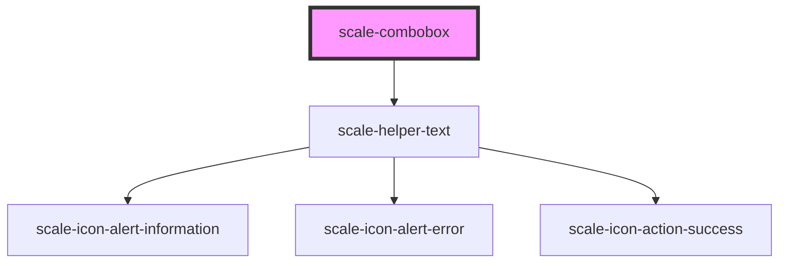

# scale-combobox

<!-- Auto Generated Below -->

## Properties

| Property              | Attribute                | Description                                                             | Type                                         | Default                                      |
| --------------------- | ------------------------ | ----------------------------------------------------------------------- | -------------------------------------------- | -------------------------------------------- |
| `allowCustom`         | `allow-custom`           | Whether to allow custom values not in the options list (default: false) | `boolean`                                    | `false`                                      |
| `dataQa`              | `data-qa`                | (optional) data-qa attribute for automated testing                      | `string`                                     | `undefined`                                  |
| `disabled`            | `disabled`               | Whether the combobox is disabled                                        | `boolean`                                    | `false`                                      |
| `filterFunction`      | `filter-function`        | Custom filtering function                                               | `(option: string, query: string) => boolean` | `undefined`                                  |
| `helperText`          | `helper-text`            | Helper text shown below the combobox                                    | `string`                                     | `''`                                         |
| `inputAriaLabel`      | `input-aria-label`       | Accessible name when no visible label is provided                       | `string`                                     | `undefined`                                  |
| `inputAriaLabelledBy` | `input-aria-labelled-by` | ID reference(s) for an external label element                           | `string`                                     | `undefined`                                  |
| `inputId`             | `input-id`               | (optional) Input element id                                             | `string`                                     | `` `combobox-input-${generateUniqueId()}` `` |
| `invalid`             | `invalid`                | Invalid state                                                           | `boolean`                                    | `false`                                      |
| `label`               | `label`                  | Combobox label                                                          | `string`                                     | `''`                                         |
| `options`             | `options`                | Available options for the combobox                                      | `string[]`                                   | `[]`                                         |
| `placeholder`         | `placeholder`            | Combobox placeholder                                                    | `string`                                     | `''`                                         |
| `required`            | `required`               | Required state                                                          | `boolean`                                    | `false`                                      |
| `styles`              | `styles`                 | (optional) Injected CSS styles                                          | `string`                                     | `undefined`                                  |
| `value`               | `value`                  | Current selected value                                                  | `string`                                     | `''`                                         |

## Events

| Event          | Description                    | Type                                     |
| -------------- | ------------------------------ | ---------------------------------------- |
| `scale-change` | Emitted when the value changes | `CustomEvent<ComboboxChangeEventDetail>` |

## Shadow Parts

| Part                   | Description |
| ---------------------- | ----------- |
| `"combobox"`           |             |
| `"combobox-container"` |             |
| `"label"`              |             |
| `"listbox"`            |             |
| `"listbox-pad"`        |             |
| `"option"`             |             |

## Dependencies

### Depends on

- [scale-helper-text](../helper-text)

### Graph

----------------------------------------------

*Built with [StencilJS](https://stenciljs.com/)*
