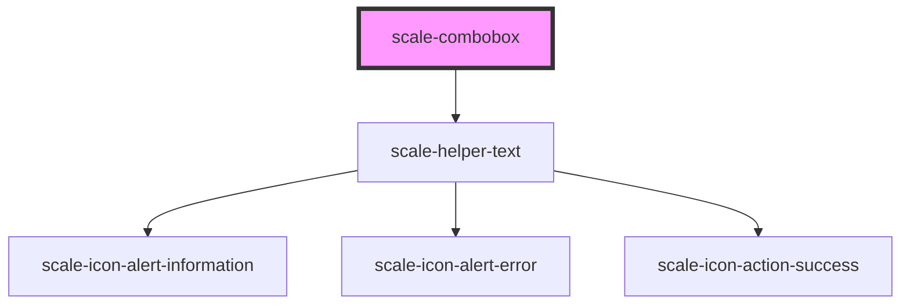

# scale-combobox

<!-- Auto Generated Below -->

## Properties

| Property         | Attribute      | Description                                            | Type                                         | Default     |
| ---------------- | -------------- | ------------------------------------------------------ | -------------------------------------------- | ----------- |
| `allowCustom`    | `allow-custom` | Whether to allow custom values not in the options list | `boolean`                                    | `true`      |
| `disabled`       | `disabled`     | Whether the combobox is disabled                       | `boolean`                                    | `false`     |
| `filterFunction` | --             | Custom filtering function                              | `(option: string, query: string) => boolean` | `undefined` |
| `helperText`     | `helper-text`  | Helper text shown below the combobox                   | `string`                                     | `''`        |
| `invalid`        | `invalid`      | Invalid state                                          | `boolean`                                    | `false`     |
| `label`          | `label`        | Combobox label                                         | `string`                                     | `''`        |
| `options`        | --             | Available options for the combobox                     | `string[]`                                   | `[]`        |
| `placeholder`    | `placeholder`  | Combobox placeholder                                   | `string`                                     | `''`        |
| `styles`         | `styles`       | (optional) Injected CSS styles                         | `string`                                     | `undefined` |
| `value`          | `value`        | Current selected value                                 | `string`                                     | `''`        |

## Events

| Event         | Description                    | Type                                     |
| ------------- | ------------------------------ | ---------------------------------------- |
| `scaleChange` | Emitted when the value changes | `CustomEvent<ComboboxChangeEventDetail>` |

## Shadow Parts

| Part                   | Description |
| ---------------------- | ----------- |
| `"combobox"`           |             |
| `"combobox-container"` |             |
| `"label"`              |             |
| `"listbox"`            |             |
| `"listbox-pad"`        |             |
| `"option"`             |             |

## Dependencies

### Depends on

- [scale-helper-text](../helper-text)

### Graph

----------------------------------------------

*Built with [StencilJS](https://stenciljs.com/)*
