# scale-data-grid

<!-- Auto Generated Below -->

## Properties

| Property              | Attribute               | Description                                                                                                                   | Type                                                                                                            | Default                     |
| --------------------- | ----------------------- | ----------------------------------------------------------------------------------------------------------------------------- | --------------------------------------------------------------------------------------------------------------- | --------------------------- |
| `fields`              | `fields`                | Input fields config array                                                                                                     | `any`                                                                                                           | `undefined`                 |
| `freezeHeader`        | `freeze-header`         | (optional) Freeze header row from scrolling                                                                                   | `boolean`                                                                                                       | `false`                     |
| `heading`             | `heading`               | (optional) Heading string                                                                                                     | `string`                                                                                                        | `''`                        |
| `height`              | `height`                | (optional) Set static table height, by default will auto-resize                                                               | `string`                                                                                                        | `undefined`                 |
| `hideBorder`          | `hide-border`           | (optional) Set to true to remove border                                                                                       | `boolean`                                                                                                       | `false`                     |
| `hideHeader`          | `hide-header`           | (optional) Set to true to hide header row                                                                                     | `boolean`                                                                                                       | `false`                     |
| `hideInfo`            | `hide-info`             | (optional) Set to true to remove info footer block including pagination and selection status                                  | `boolean`                                                                                                       | `false`                     |
| `hideMenu`            | `hide-menu`             | (optional) Set to true to hide settings menu                                                                                  | `boolean`                                                                                                       | `false`                     |
| `localization`        | --                      | (optional) set localization for sort, toggle, select/deselect, table options, expand/collapse (html cell) Default is English. | `{ sortBy: string; toggle: string; select: string; tableOptions: string; expand?: string; collapse?: string; }` | `undefined`                 |
| `numbered`            | `numbered`              | (optional) Set to true to add numbers column                                                                                  | `boolean`                                                                                                       | `false`                     |
| `pageSize`            | `page-size`             | (optional) Set number of rows to display per pagination page                                                                  | `number`                                                                                                        | `Infinity`                  |
| `rows`                | `rows`                  | Input data array                                                                                                              | `any`                                                                                                           | `undefined`                 |
| `selectable`          | `selectable`            | (optional) Set to true to add selection column                                                                                | `boolean`                                                                                                       | `false`                     |
| `selection`           | --                      | Read-only selection array - populated with raw data from selected rows                                                        | `any[]`                                                                                                         | `[]`                        |
| `shadeAlternate`      | `shade-alternate`       | (optional) Shade every second row darker                                                                                      | `boolean`                                                                                                       | `true`                      |
| `sortableColumnTitle` | `sortable-column-title` | (optional) Title for sortable columns                                                                                         | `string`                                                                                                        | `'Activate to sort column'` |
| `styles`              | `styles`                | (optional) Injected css styles                                                                                                | `any`                                                                                                           | `undefined`                 |
| `visible`             | `visible`               | (optional) Set to false to hide table, used for nested tables to re-render upon toggle                                        | `boolean`                                                                                                       | `true`                      |

## Events

| Event             | Description                                                                                        | Type                                     |
| ----------------- | -------------------------------------------------------------------------------------------------- | ---------------------------------------- |
| `scale-edit`      | Event triggered every time the editable cells are changed, updating the original rows data         | `CustomEvent<DataGridEditEventDetail>`   |
| `scale-selection` | Event triggered every time the selection list updates                                              | `CustomEvent<any[]>`                     |
| `scale-sort`      | Event triggered every time the data is sorted, changing original rows data                         | `CustomEvent<DataGridSortedEventDetail>` |
| `scaleEdit`       | **[DEPRECATED]** in v3 in favor of kebab-case event names   | `CustomEvent<DataGridEditEventDetail>`   |
| `scaleSort`       | **[DEPRECATED]** in v3 in favor of kebab-case event names   | `CustomEvent<DataGridSortedEventDetail>` |

## Dependencies

### Depends on

- [scale-menu-flyout](../menu-flyout)
- [scale-button](../button)
- [scale-icon-service-settings](../icons/service-settings)
- [scale-menu-flyout-list](../menu-flyout-list)
- [scale-menu-flyout-item](../menu-flyout-item)
- [scale-icon-action-sort](../icons/action-sort)
- [scale-icon-navigation-collapse-up](../icons/navigation-collapse-up)
- [scale-icon-navigation-collapse-down](../icons/navigation-collapse-down)
- [scale-icon-action-hide-password](../icons/action-hide-password)
- [scale-icon](../icon)
- [scale-icon-content-sort-indicator-up](../icons/content-sort-indicator-up)
- [scale-icon-content-sort-indicator-down](../icons/content-sort-indicator-down)
- [scale-checkbox](../checkbox)
- [scale-pagination](../pagination)
- [scale-switch](../switch)
- [scale-link](../link)
- [scale-progress-bar](../progress-bar)
- [scale-dropdown-select](../dropdown-select)
- [scale-dropdown-select-item](../dropdown-select-item)
- [scale-tag](../tag)
- [scale-text-field](../text-field)
- [scale-icon-action-edit](../icons/action-edit)
- [scale-icon-action-remove](../icons/action-remove)

### Graph

```mermaid
graph TD;
  scale-data-grid --> scale-menu-flyout
  scale-data-grid --> scale-button
  scale-data-grid --> scale-icon-service-settings
  scale-data-grid --> scale-menu-flyout-list
  scale-data-grid --> scale-menu-flyout-item
  scale-data-grid --> scale-icon-action-sort
  scale-data-grid --> scale-icon-navigation-collapse-up
  scale-data-grid --> scale-icon-navigation-collapse-down
  scale-data-grid --> scale-icon-action-hide-password
  scale-data-grid --> scale-icon
  scale-data-grid --> scale-icon-content-sort-indicator-up
  scale-data-grid --> scale-icon-content-sort-indicator-down
  scale-data-grid --> scale-checkbox
  scale-data-grid --> scale-pagination
  scale-data-grid --> scale-switch
  scale-data-grid --> scale-link
  scale-data-grid --> scale-progress-bar
  scale-data-grid --> scale-dropdown-select
  scale-data-grid --> scale-dropdown-select-item
  scale-data-grid --> scale-tag
  scale-data-grid --> scale-text-field
  scale-data-grid --> scale-icon-action-edit
  scale-data-grid --> scale-icon-action-remove
  scale-menu-flyout-item --> scale-icon-action-checkmark
  scale-menu-flyout-item --> scale-icon-navigation-right
  scale-checkbox --> scale-icon-action-minus
  scale-checkbox --> scale-icon-action-checkmark
  scale-checkbox --> scale-icon-alert-information
  scale-checkbox --> scale-icon-alert-error
  scale-pagination --> scale-icon-navigation-double-left
  scale-pagination --> scale-icon-navigation-left
  scale-pagination --> scale-icon-navigation-right
  scale-pagination --> scale-icon-navigation-double-right
  scale-switch --> scale-icon-action-checkmark
  scale-progress-bar --> scale-icon-alert-error
  scale-progress-bar --> scale-icon-action-success
  scale-dropdown-select --> scale-icon-action-checkmark
  scale-dropdown-select --> scale-icon-navigation-collapse-up
  scale-dropdown-select --> scale-icon-navigation-collapse-down
  scale-dropdown-select --> scale-helper-text
  scale-helper-text --> scale-icon-alert-information
  scale-helper-text --> scale-icon-alert-error
  scale-helper-text --> scale-icon-action-success
  scale-tag --> scale-icon-action-close
  scale-text-field --> scale-helper-text
  style scale-data-grid fill:#f9f,stroke:#333,stroke-width:4px
```

----------------------------------------------

*Built with [StencilJS](https://stenciljs.com/)*
