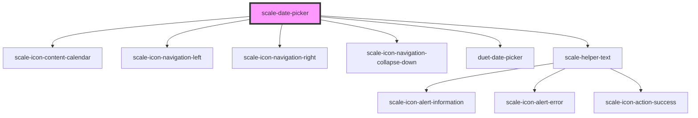

# scale-date-picker

<!-- Auto Generated Below -->

## Properties

| Property         | Attribute           | Description                                                                                                                                                                                                                                           | Type                                                    | Default           |
| ---------------- | ------------------- | ----------------------------------------------------------------------------------------------------------------------------------------------------------------------------------------------------------------------------------------------------- | ------------------------------------------------------- | ----------------- |
| `ariaDetailsId`  | `aria-details-id`   | (optional) id or space separated list of ids of elements that provide or link to additional related information.                                                                                                                                      | `string`                                                | `undefined`       |
| `dateAdapter`    | `date-adapter`      | Date adapter, for custom parsing/formatting. Must be object with a `parse` function which accepts a `string` and returns a `Date`, and a `format` function which accepts a `Date` and returns a `string`. Default is IS0-8601 parsing and formatting. | `any`                                                   | `undefined`       |
| `direction`      | `direction`         | Forces the opening direction of the calendar modal to be always left or right. This setting can be useful when the input is smaller than the opening date picker would be as by default the picker always opens towards right.                        | `"left" \| "right"`                                     | `'right'`         |
| `disabled`       | `disabled`          | Makes the date picker input component disabled. This prevents users from being able to interact with the input, and conveys its inactive state to assistive technologies.                                                                             | `boolean`                                               | `false`           |
| `firstDayOfWeek` | `first-day-of-week` | Which day is considered first day of the week? `0` for Sunday, `1` for Monday, etc. Default is Monday.                                                                                                                                                | `any`                                                   | `undefined`       |
| `helperText`     | `helper-text`       | (optional) Helper text                                                                                                                                                                                                                                | `string`                                                | `''`              |
| `identifier`     | `identifier`        | Adds a unique identifier for the date picker input. Use this instead of html `id` attribute.                                                                                                                                                          | `string`                                                | `undefined`       |
| `innerRole`      | `inner-role`        | Defines a specific role attribute for the date picker input.                                                                                                                                                                                          | `string`                                                | `undefined`       |
| `invalid`        | `invalid`           | (optional) invalid status                                                                                                                                                                                                                             | `boolean`                                               | `undefined`       |
| `label`          | `label`             | (optional) Label                                                                                                                                                                                                                                      | `string`                                                | `''`              |
| `localization`   | --                  | Button labels, day names, month names, etc, used for localization. Default is English.                                                                                                                                                                | `DuetLocalizedText & { today: string; }`                | `undefined`       |
| `max`            | `max`               | Maximum date allowed to be picked. Must be in IS0-8601 format: YYYY-MM-DD. This setting can be used alone or together with the min property.                                                                                                          | `string`                                                | `''`              |
| `min`            | `min`               | Minimum date allowed to be picked. Must be in IS0-8601 format: YYYY-MM-DD. This setting can be used alone or together with the max property.                                                                                                          | `string`                                                | `''`              |
| `name`           | `name`              | Name of the date picker input.                                                                                                                                                                                                                        | `string`                                                | `'date'`          |
| `placeholder`    | `placeholder`       | (optional) Input place holder                                                                                                                                                                                                                         | `string`                                                | `''`              |
| `popupTitle`     | `popup-title`       | **[DEPRECATED]** in v3 in favor of localization.calendarHeading                                                                                                                                                | `string`                                                | `'Pick a date'`   |
| `required`       | `required`          | Should the input be marked as required?                                                                                                                                                                                                               | `boolean`                                               | `false`           |
| `size`           | `size`              | **[DEPRECATED]**                                                                                                                                                                                               | `string`                                                | `undefined`       |
| `status`         | `status`            | **[DEPRECATED]** - invalid should replace status                                                                                                                                                               | `string`                                                | `''`              |
| `styles`         | `styles`            | (optional) Injected CSS styles                                                                                                                                                                                                                        | `string`                                                | `undefined`       |
| `value`          | `value`             | Date value. Must be in IS0-8601 format: YYYY-MM-DD.                                                                                                                                                                                                   | `string`                                                | `''`              |
| `variant`        | `variant`           |                                                                                                                                                                                                                                                       | `"danger" \| "informational" \| "success" \| "warning"` | `'informational'` |

## Events

| Event          | Description                                                                                        | Type                                                                                |
| -------------- | -------------------------------------------------------------------------------------------------- | ----------------------------------------------------------------------------------- |
| `scale-blur`   | Event emitted the date picker input is blurred.                                                    | `CustomEvent<{ component: "duet-date-picker"; }>`                                   |
| `scale-change` | Event emitted when a date is selected.                                                             | `CustomEvent<{ component: "duet-date-picker"; valueAsDate: Date; value: string; }>` |
| `scale-focus`  | Event emitted the date picker input is focused.                                                    | `CustomEvent<{ component: "duet-date-picker"; }>`                                   |
| `scaleBlur`    | **[DEPRECATED]** in v3 in favor of kebab-case event names   | `CustomEvent<{ component: "duet-date-picker"; }>`                                   |
| `scaleChange`  | **[DEPRECATED]** in v3 in favor of kebab-case event names   | `CustomEvent<{ component: "duet-date-picker"; valueAsDate: Date; value: string; }>` |
| `scaleFocus`   | **[DEPRECATED]** in v3 in favor of kebab-case event names   | `CustomEvent<{ component: "duet-date-picker"; }>`                                   |

## Methods

### `hide(moveFocusToButton?: boolean) => Promise<void>`

Hide the calendar modal. Set `moveFocusToButton` to false to prevent focus
returning to the date picker's button. Default is true.

#### Returns

Type: `Promise<void>`

### `setFocus() => Promise<void>`

Sets focus on the date picker's input. Use this method instead of the global `focus()`.

#### Returns

Type: `Promise<void>`

### `show() => Promise<void>`

Show the calendar modal, moving focus to the calendar inside.

#### Returns

Type: `Promise<void>`

## Dependencies

### Depends on

- [scale-icon-content-calendar](../icons/content-calendar)
- [scale-icon-navigation-left](../icons/navigation-left)
- [scale-icon-navigation-right](../icons/navigation-right)
- [scale-icon-navigation-collapse-down](../icons/navigation-collapse-down)
- duet-date-picker
- [scale-helper-text](../helper-text)

### Graph

----------------------------------------------

*Built with [StencilJS](https://stenciljs.com/)*
