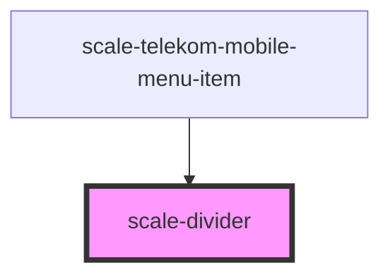

# scale-divider

<!-- Auto Generated Below -->

## Properties

| Property   | Attribute  | Description                    | Type      | Default     |
| ---------- | ---------- | ------------------------------ | --------- | ----------- |
| `styles`   | `styles`   | (optional) Injected CSS styles | `string`  | `undefined` |
| `vertical` | `vertical` | (optional) Divider vertical    | `boolean` | `false`     |

## Shadow Parts

| Part                | Description |
| ------------------- | ----------- |
| `"rule-horizontal"` |             |
| `"rule-vertical"`   |             |

## Dependencies

### Used by

 - [scale-telekom-mobile-menu-item](../telekom/telekom-mobile-menu-item)

### Graph

----------------------------------------------

*Built with [StencilJS](https://stenciljs.com/)*
