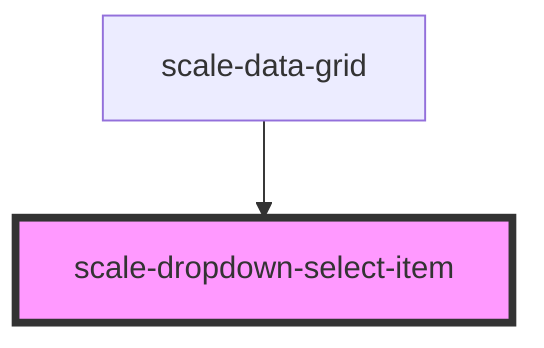

# scale-dropdown-select-item

<!-- Auto Generated Below -->

## Properties

| Property   | Attribute  | Description | Type      | Default     |
| ---------- | ---------- | ----------- | --------- | ----------- |
| `disabled` | `disabled` |             | `boolean` | `undefined` |
| `focused`  | `focused`  |             | `boolean` | `undefined` |
| `selected` | `selected` |             | `boolean` | `undefined` |
| `value`    | `value`    |             | `any`     | `undefined` |

## Shadow Parts

| Part       | Description |
| ---------- | ----------- |
| `"base"`   |             |
| `"label"`  |             |
| `"prefix"` |             |
| `"suffix"` |             |

## Dependencies

### Used by

 - [scale-data-grid](../data-grid)

### Graph

----------------------------------------------

*Built with [StencilJS](https://stenciljs.com/)*
