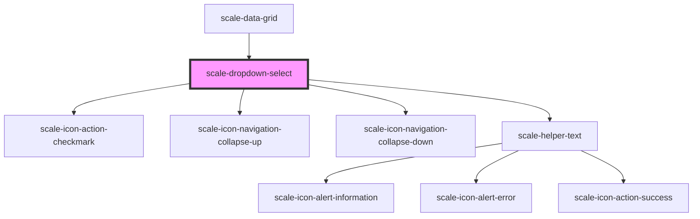

# scale-select

<!-- Auto Generated Below -->

## Properties

| Property            | Attribute             | Description                  | Type                                                    | Default           |
| ------------------- | --------------------- | ---------------------------- | ------------------------------------------------------- | ----------------- |
| `comboboxId`        | `combobox-id`         |                              | `string`                                                | `'combobox'`      |
| `disabled`          | `disabled`            |                              | `boolean`                                               | `undefined`       |
| `floatingStrategy`  | `floating-strategy`   |                              | `"absolute" \| "fixed"`                                 | `'absolute'`      |
| `helperText`        | `helper-text`         |                              | `string`                                                | `''`              |
| `hideLabelVisually` | `hide-label-visually` | (optional) to hide the label | `boolean`                                               | `false`           |
| `invalid`           | `invalid`             |                              | `boolean`                                               | `false`           |
| `label`             | `label`               |                              | `string`                                                | `undefined`       |
| `name`              | `name`                |                              | `string`                                                | `undefined`       |
| `readonly`          | `readonly`            |                              | `boolean`                                               | `undefined`       |
| `transparent`       | `transparent`         |                              | `boolean`                                               | `undefined`       |
| `value`             | `value`               |                              | `any`                                                   | `undefined`       |
| `variant`           | `variant`             |                              | `"danger" \| "informational" \| "success" \| "warning"` | `'informational'` |

## Events

| Event           | Description | Type                |
| --------------- | ----------- | ------------------- |
| `scale-blur`    |             | `CustomEvent<void>` |
| `scale-change`  |             | `CustomEvent<void>` |
| `scale-focus`   |             | `CustomEvent<void>` |
| `scale-keydown` |             | `CustomEvent<void>` |

## Shadow Parts

| Part                         | Description |
| ---------------------------- | ----------- |
| `"combobox-container"`       |             |
| `"combobox-value"`           |             |
| `"icon"`                     |             |
| `"label"`                    |             |
| `"listbox"`                  |             |
| `"listbox-pad"`              |             |
| `"listbox-scroll-container"` |             |

## Dependencies

### Used by

 - [scale-data-grid](../data-grid)

### Depends on

- [scale-icon-action-checkmark](../icons/action-checkmark)
- [scale-icon-navigation-collapse-up](../icons/navigation-collapse-up)
- [scale-icon-navigation-collapse-down](../icons/navigation-collapse-down)
- [scale-helper-text](../helper-text)

### Graph

----------------------------------------------

*Built with [StencilJS](https://stenciljs.com/)*
