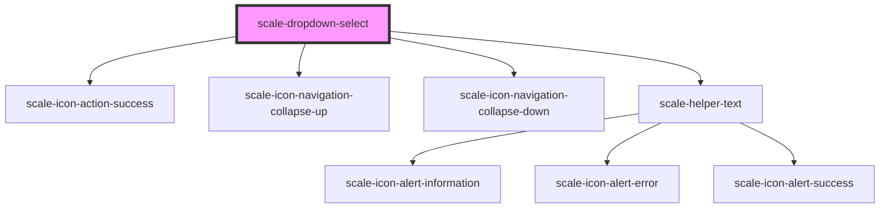

# scale-select

<!-- Auto Generated Below -->

## Properties

| Property      | Attribute     | Description | Type                                                    | Default           |
| ------------- | ------------- | ----------- | ------------------------------------------------------- | ----------------- |
| `comboboxId`  | `combobox-id` |             | `string`                                                | `'combobox'`      |
| `disabled`    | `disabled`    |             | `boolean`                                               | `undefined`       |
| `helperText`  | `helper-text` |             | `string`                                                | `''`              |
| `invalid`     | `invalid`     |             | `boolean`                                               | `false`           |
| `label`       | `label`       |             | `string`                                                | `undefined`       |
| `readonly`    | `readonly`    |             | `boolean`                                               | `undefined`       |
| `transparent` | `transparent` |             | `boolean`                                               | `undefined`       |
| `value`       | `value`       |             | `any`                                                   | `undefined`       |
| `variant`     | `variant`     |             | `"danger" \| "informational" \| "success" \| "warning"` | `'informational'` |

## Events

| Event           | Description | Type                |
| --------------- | ----------- | ------------------- |
| `scale-blur`    |             | `CustomEvent<void>` |
| `scale-change`  |             | `CustomEvent<void>` |
| `scale-focus`   |             | `CustomEvent<void>` |
| `scale-keydown` |             | `CustomEvent<void>` |

## Shadow Parts

| Part                   | Description |
| ---------------------- | ----------- |
| `"combobox-container"` |             |
| `"icon"`               |             |
| `"label"`              |             |
| `"listbox"`            |             |
| `"listbox-pad"`        |             |

## Dependencies

### Depends on

- [scale-icon-action-success](../icons/action-success)
- [scale-icon-navigation-collapse-up](../icons/navigation-collapse-up)
- [scale-icon-navigation-collapse-down](../icons/navigation-collapse-down)
- [scale-helper-text](../helper-text)

### Graph

----------------------------------------------

*Built with [StencilJS](https://stenciljs.com/)*
