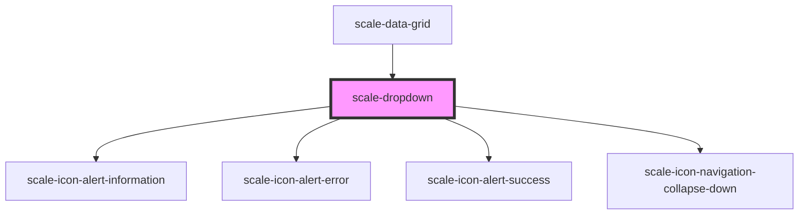

# scale-dropdown

<!-- Auto Generated Below -->

## Properties

| Property      | Attribute      | Description                                                                               | Type               | Default     |
| ------------- | -------------- | ----------------------------------------------------------------------------------------- | ------------------ | ----------- |
| `controlled`  | `controlled`   | (optional) Makes type `select` behave as a controlled component in React                  | `boolean`          | `false`     |
| `disabled`    | `disabled`     | (optional) Input disabled                                                                 | `boolean`          | `undefined` |
| `helperText`  | `helper-text`  | (optional) Input helper text                                                              | `string`           | `''`        |
| `info`        | `info`         | (optional) Input status                                                                   | `boolean`          | `true`      |
| `inputId`     | `input-id`     | (optional) Input checkbox id                                                              | `string`           | `undefined` |
| `invalid`     | `invalid`      |                                                                                           | `boolean`          | `false`     |
| `label`       | `label`        | (optional) Input label                                                                    | `string`           | `''`        |
| `multiple`    | `multiple`     | (optional) select multiple options                                                        | `boolean`          | `undefined` |
| `name`        | `name`         | (optional) Input name                                                                     | `string`           | `''`        |
| `required`    | `required`     | (optional) Input required                                                                 | `boolean`          | `undefined` |
| `size`        | `size`         | **[DEPRECATED]**                                   | `string`           | `undefined` |
| `status`      | `status`       | **[DEPRECATED]** - invalid should replace status   | `string`           | `''`        |
| `styles`      | `styles`       | (optional) Injected CSS styles                                                            | `string`           | `undefined` |
| `success`     | `success`      | (optional) Input status                                                                   | `boolean`          | `false`     |
| `transparent` | `transparent`  | (optional) input background transparent                                                   | `boolean`          | `undefined` |
| `value`       | `value`        | (optional) Input value                                                                    | `number \| string` | `''`        |
| `visibleSize` | `visible-size` | (optional) the number of visible options in a select drop-down list                       | `number`           | `undefined` |
| `warning`     | `warning`      | (optional) Input status                                                                   | `boolean`          | `false`     |

## Events

| Event           | Description                                                                                        | Type                                  |
| --------------- | -------------------------------------------------------------------------------------------------- | ------------------------------------- |
| `scale-blur`    | Emitted when the input loses focus.                                                                | `CustomEvent<void>`                   |
| `scale-change`  | Emitted when the value has changed.                                                                | `CustomEvent<InputChangeEventDetail>` |
| `scale-focus`   | Emitted when the input has focus.                                                                  | `CustomEvent<void>`                   |
| `scale-input`   | Emitted when a keyboard input occurred.                                                            | `CustomEvent<KeyboardEvent>`          |
| `scale-keydown` | Emitted on keydown.                                                                                | `CustomEvent<KeyboardEvent>`          |
| `scaleBlur`     | **[DEPRECATED]** in v3 in favor of kebab-case event names   | `CustomEvent<void>`                   |
| `scaleChange`   | **[DEPRECATED]** in v3 in favor of kebab-case event names   | `CustomEvent<InputChangeEventDetail>` |
| `scaleFocus`    | **[DEPRECATED]** in v3 in favor of kebab-case event names   | `CustomEvent<void>`                   |
| `scaleInput`    | **[DEPRECATED]** in v3 in favor of kebab-case event names   | `CustomEvent<KeyboardEvent>`          |
| `scaleKeydown`  | **[DEPRECATED]** in v3 in favor of kebab-case event names   | `CustomEvent<KeyboardEvent>`          |

## Dependencies

### Used by

 - [scale-data-grid](../data-grid)

### Depends on

- [scale-icon-alert-information](../icons/alert-information)
- [scale-icon-alert-error](../icons/alert-error)
- [scale-icon-alert-success](../icons/alert-success)
- [scale-icon-navigation-collapse-down](../icons/navigation-collapse-down)

### Graph

----------------------------------------------

*Built with [StencilJS](https://stenciljs.com/)*
