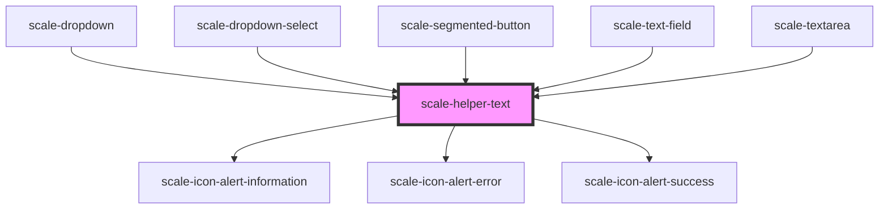

# scale-helper-text

<!-- Auto Generated Below -->

## Properties

| Property     | Attribute     | Description                    | Type                                                                 | Default           |
| ------------ | ------------- | ------------------------------ | -------------------------------------------------------------------- | ----------------- |
| `helperText` | `helper-text` | (optional) Helper text         | `string`                                                             | `undefined`       |
| `styles`     | `styles`      | (optional) Injected CSS styles | `string`                                                             | `undefined`       |
| `variant`    | `variant`     | (optional) Injected CSS styles | `"danger" \| "informational" \| "neutral" \| "success" \| "warning"` | `'informational'` |

## Slots

| Slot        | Description                                                          |
| ----------- | -------------------------------------------------------------------- |
| `"default"` | here goes the actual text of the                                     |
| `"icon"`    | a slot that will not be underlined and which position can be changed |

## Shadow Parts

| Part        | Description                                          |
| ----------- | ---------------------------------------------------- |
| `"anchor"`  | the native achor element wrapping all contents       |
| `"base"`    |                                                      |
| `"content"` | a wrapper around the default slot with the underline |
| `"text"`    |                                                      |

## Dependencies

### Used by

 - [scale-dropdown](../dropdown)
 - [scale-dropdown-select](../dropdown-select)
 - [scale-segmented-button](../segmented-button)
 - [scale-text-field](../text-field)
 - [scale-textarea](../textarea)

### Depends on

- [scale-icon-alert-information](../icons/alert-information)
- [scale-icon-alert-error](../icons/alert-error)
- [scale-icon-alert-success](../icons/alert-success)

### Graph

----------------------------------------------

*Built with [StencilJS](https://stenciljs.com/)*
