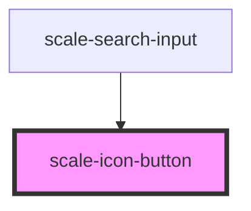

# scale-icon-button

<!-- Auto Generated Below -->

## Properties

| Property        | Attribute        | Description                                                                                               | Type                              | Default     |
| --------------- | ---------------- | --------------------------------------------------------------------------------------------------------- | --------------------------------- | ----------- |
| `active`        | `active`         | (optional) Set the element to active state                                                                | `boolean`                         | `undefined` |
| `download`      | `download`       | (optional) Name of a file to be downloaded                                                                | `string`                          | `undefined` |
| `innerTabindex` | `inner-tabindex` | (optional) Set `tabindex` in the inner button or link element                                             | `number`                          | `undefined` |
| `name`          | `name`           | (optional) The name of the button, submitted as a pair with the button's `value` as part of the form data | `string`                          | `undefined` |
| `size`          | `size`           | (optional) The size of the element                                                                        | `"medium" \| "small"`             | `'medium'`  |
| `type`          | `type`           | (optional) Button type                                                                                    | `"button" \| "reset" \| "submit"` | `undefined` |
| `value`         | `value`          | (optional) Defines the value associated with the button's `name`                                          | `string`                          | `undefined` |

## Methods

### `setFocus() => Promise<void>`

#### Returns

Type: `Promise<void>`

## Dependencies

### Used by

 - [scale-search-input](../search-input)

### Graph

----------------------------------------------

*Built with [StencilJS](https://stenciljs.com/)*
