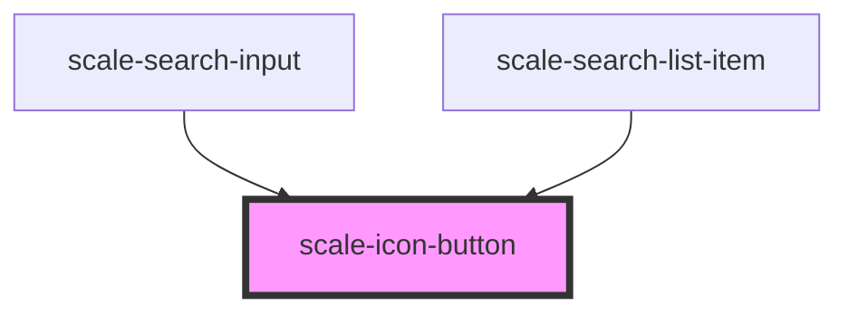

# scale-icon-button

<!-- Auto Generated Below -->

## Properties

| Property         | Attribute         | Description                                                                                               | Type                                   | Default      |
| ---------------- | ----------------- | --------------------------------------------------------------------------------------------------------- | -------------------------------------- | ------------ |
| `active`         | `active`          | (optional) Set the element to active state                                                                | `boolean`                              | `undefined`  |
| `disabled`       | `disabled`        | (optional) If `true`, the button is disabled                                                              | `boolean`                              | `false`      |
| `download`       | `download`        | (optional) Name of a file to be downloaded                                                                | `string`                               | `undefined`  |
| `innerTabindex`  | `inner-tabindex`  | (optional) Set `tabindex` in the inner button or link element                                             | `number`                               | `undefined`  |
| `label`          | `label`           | (optional) Element label                                                                                  | `string`                               | `undefined`  |
| `labelPlacement` | `label-placement` | (optional) Label placement                                                                                | `"bottom" \| "right"`                  | `'bottom'`   |
| `name`           | `name`            | (optional) The name of the button, submitted as a pair with the button's `value` as part of the form data | `string`                               | `undefined`  |
| `size`           | `size`            | (optional) The size of the element                                                                        | `"large" \| "small" \| "standard"`     | `'standard'` |
| `type`           | `type`            | (optional) Button type                                                                                    | `"activate" \| "standard" \| "toggle"` | `'standard'` |
| `value`          | `value`           | (optional) Defines the value associated with the button's `name`                                          | `string`                               | `undefined`  |

## Events

| Event          | Description                         | Type               |
| -------------- | ----------------------------------- | ------------------ |
| `scale-change` | Emitted when the switch was clicked | `CustomEvent<any>` |

## Methods

### `setFocus() => Promise<void>`

#### Returns

Type: `Promise<void>`

## Dependencies

### Used by

 - [scale-search-input](../search-input)
 - [scale-search-list-item](../search-list-item)

### Graph

----------------------------------------------

*Built with [StencilJS](https://stenciljs.com/)*
