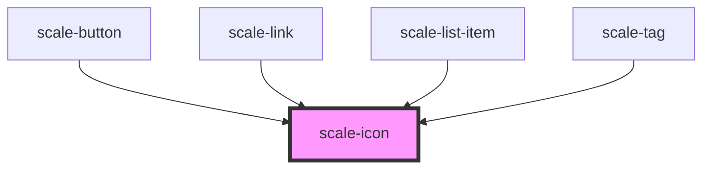

# scale-icon

<!-- Auto Generated Below -->

## Usage

### Icon

### Default

<scale-icon path="M16.471,8.321 L12.613594,0.502886112 L8.755,8.321 L0.126435258,9.57533801 L6.37,15.66 L4.89610548,24.2548735 L12.613,20.197 L20.3310826,24.2548735 L18.856,15.66 L25.1007528,9.57533801 L16.471,8.321 Z M9.41891527,9.23556376 L12.613,2.761 L15.8082728,9.23556376 L22.951,10.273 L17.7826928,15.3122039 L19.003,22.427 L12.613594,19.067774 L6.223,22.427 L7.44449521,15.3122039 L2.275,10.273 L9.41891527,9.23556376 Z">
</scale-icon>

### Color
<scale-icon color="red" path="M16.471,8.321 L12.613594,0.502886112 L8.755,8.321 L0.126435258,9.57533801 L6.37,15.66 L4.89610548,24.2548735 L12.613,20.197 L20.3310826,24.2548735 L18.856,15.66 L25.1007528,9.57533801 L16.471,8.321 Z M9.41891527,9.23556376 L12.613,2.761 L15.8082728,9.23556376 L22.951,10.273 L17.7826928,15.3122039 L19.003,22.427 L12.613594,19.067774 L6.223,22.427 L7.44449521,15.3122039 L2.275,10.273 L9.41891527,9.23556376 Z">
</scale-icon>

### Size
<scale-icon size="32" path="M16.471,8.321 L12.613594,0.502886112 L8.755,8.321 L0.126435258,9.57533801 L6.37,15.66 L4.89610548,24.2548735 L12.613,20.197 L20.3310826,24.2548735 L18.856,15.66 L25.1007528,9.57533801 L16.471,8.321 Z M9.41891527,9.23556376 L12.613,2.761 L15.8082728,9.23556376 L22.951,10.273 L17.7826928,15.3122039 L19.003,22.427 L12.613594,19.067774 L6.223,22.427 L7.44449521,15.3122039 L2.275,10.273 L9.41891527,9.23556376 Z">
</scale-icon>

### Height & width
<scale-icon height="32" width="64" path="M16.471,8.321 L12.613594,0.502886112 L8.755,8.321 L0.126435258,9.57533801 L6.37,15.66 L4.89610548,24.2548735 L12.613,20.197 L20.3310826,24.2548735 L18.856,15.66 L25.1007528,9.57533801 L16.471,8.321 Z M9.41891527,9.23556376 L12.613,2.761 L15.8082728,9.23556376 L22.951,10.273 L17.7826928,15.3122039 L19.003,22.427 L12.613594,19.067774 L6.223,22.427 L7.44449521,15.3122039 L2.275,10.273 L9.41891527,9.23556376 Z">
</scale-icon>

## Properties

| Property      | Attribute      | Description                    | Type                                     | Default     |
| ------------- | -------------- | ------------------------------ | ---------------------------------------- | ----------- |
| `customClass` | `custom-class` | (optional) Tag class           | `string`                                 | `''`        |
| `focusable`   | `focusable`    |                                | `boolean`                                | `false`     |
| `height`      | `height`       |                                | `number`                                 | `24`        |
| `name`        | `name`         | (optional) Tag theme           | `string`                                 | `undefined` |
| `path`        | `path`         |                                | `string`                                 | `undefined` |
| `size`        | `size`         |                                | `number`                                 | `undefined` |
| `styles`      | --             | (optional) Injected jss styles | `StyleSheet<string \| number \| symbol>` | `undefined` |
| `viewBox`     | `view-box`     |                                | `string`                                 | `undefined` |
| `width`       | `width`        |                                | `number`                                 | `24`        |

## Dependencies

### Used by

 - [scale-button](../button)
 - [scale-link](../link)
 - [scale-list-item](../list/listItem)
 - [scale-tag](../tag)

### Graph

----------------------------------------------

*Built with [StencilJS](https://stenciljs.com/)*
