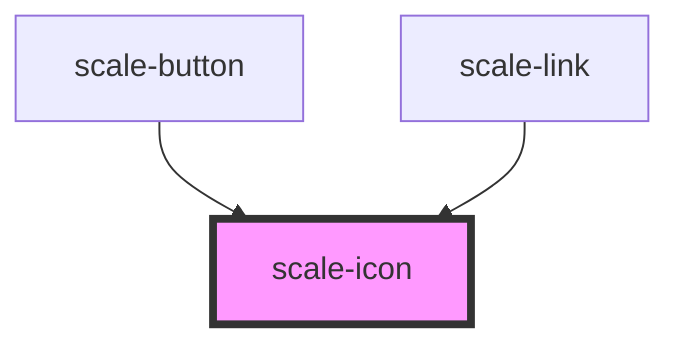

# scale-icon

<!-- Auto Generated Below -->

## Properties

| Property      | Attribute      | Description                    | Type                                     | Default     |
| ------------- | -------------- | ------------------------------ | ---------------------------------------- | ----------- |
| `customClass` | `custom-class` | (optional) Tag class           | `string`                                 | `''`        |
| `height`      | `height`       |                                | `number`                                 | `24`        |
| `name`        | `name`         | (optional) Tag theme           | `string`                                 | `undefined` |
| `path`        | `path`         |                                | `string`                                 | `undefined` |
| `size`        | `size`         |                                | `number`                                 | `undefined` |
| `styles`      | --             | (optional) Injected jss styles | `StyleSheet<string \| number \| symbol>` | `undefined` |
| `width`       | `width`        |                                | `number`                                 | `24`        |

## Dependencies

### Used by

 - [scale-button](../button)
 - [scale-link](../link)

### Graph

----------------------------------------------

*Built with [StencilJS](https://stenciljs.com/)*
