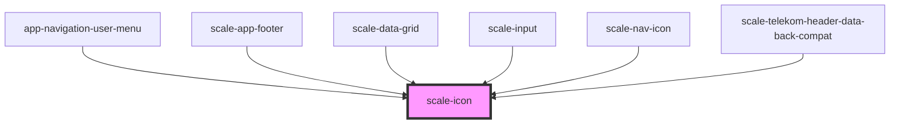

# scale-icon

<!-- Auto Generated Below -->

## Properties

| Property             | Attribute             | Description                                                                                                                                                                                                                                                                                                                                                    | Type      | Default                             |
| -------------------- | --------------------- | -------------------------------------------------------------------------------------------------------------------------------------------------------------------------------------------------------------------------------------------------------------------------------------------------------------------------------------------------------------- | --------- | ----------------------------------- |
| `accessibilityTitle` | `accessibility-title` | (optional) When using the icon as standalone, make it meaningful for accessibility                                                                                                                                                                                                                                                                             | `string`  | `undefined`                         |
| `decorative`         | `decorative`          | (optional) If `true` the svg element will get aria-hidden="true"                                                                                                                                                                                                                                                                                               | `boolean` | `false`                             |
| `fill`               | `fill`                | The SVG `fill` attribute                                                                                                                                                                                                                                                                                                                                       | `string`  | `'var(--icon-color, currentColor)'` |
| `focusable`          | `focusable`           | (optional) If `true` the icon can receive focus                                                                                                                                                                                                                                                                                                                | `boolean` | `false`                             |
| `name`               | `name`                | A name that will be used to reference an SVG object defined elsewhere, via `<use xlink:href="">`. `icon-` will be prepended to the name, so if you pass `circle`, it will look for for the `icon-circle` id e.g. `<use xlink:href="#icon-circle">`. If there is no element in the document with the id by the name provided, this component will render empty. | `string`  | `undefined`                         |
| `path`               | `path`                | A path shape to be used in the `d` attribute of a path element.                                                                                                                                                                                                                                                                                                | `string`  | `undefined`                         |
| `size`               | `size`                | Will be used for both `width` and `height`, all icons are square. Keep in mind the `viewBox` attribute is set to "0 0 24 24".                                                                                                                                                                                                                                  | `number`  | `20`                                |
| `stroke`             | `stroke`              | The SVG `stroke` attribute                                                                                                                                                                                                                                                                                                                                     | `string`  | `'transparent'`                     |

## Dependencies

### Used by

 - [app-navigation-user-menu](../telekom/app-navigation-user-menu)
 - [scale-app-footer](../telekom/app-footer)
 - [scale-data-grid](../data-grid)
 - [scale-input](../input)
 - [scale-nav-icon](../telekom/nav-icon)
 - [scale-telekom-header-data-back-compat](../telekom/telekom-header-data-back-compat)

### Graph

----------------------------------------------

*Built with [StencilJS](https://stenciljs.com/)*
