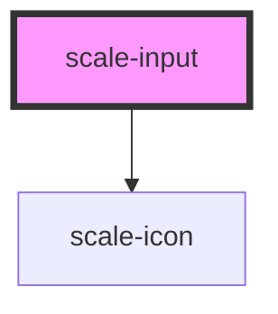

# scale-input

<!-- Auto Generated Below -->

## Properties

| Property        | Attribute        | Description                            | Type                                                                                                               | Default     |
| --------------- | ---------------- | -------------------------------------- | ------------------------------------------------------------------------------------------------------------------ | ----------- |
| `cols`          | `cols`           | (optional) textarea column             | `number`                                                                                                           | `undefined` |
| `counter`       | `counter`        | (optional) Input counter               | `boolean`                                                                                                          | `undefined` |
| `customClass`   | `custom-class`   | (optional) Input text class            | `string`                                                                                                           | `''`        |
| `disableResize` | `disable-resize` | (optional) textarea disableResize      | `boolean`                                                                                                          | `undefined` |
| `disabled`      | `disabled`       | (optional) Input disabled              | `boolean`                                                                                                          | `undefined` |
| `helperText`    | `helper-text`    | (optional) Input helper text           | `string`                                                                                                           | `''`        |
| `icon`          | `icon`           | (optional) Input checkbox checked icon | `string`                                                                                                           | `undefined` |
| `inputId`       | `input-id`       | (optional) Input checkbox id           | `string`                                                                                                           | `undefined` |
| `label`         | `label`          | (optional) Input label                 | `string`                                                                                                           | `''`        |
| `maxLength`     | `max-length`     | (optional) Input max length            | `number`                                                                                                           | `undefined` |
| `minLength`     | `min-length`     | (optional) Input min length            | `number`                                                                                                           | `undefined` |
| `name`          | `name`           | (optional) Input name                  | `string`                                                                                                           | `''`        |
| `placeholder`   | `placeholder`    | (optional) Input placeHolder           | `string`                                                                                                           | `''`        |
| `preChecked`    | `pre-checked`    | (optional) radio checked value         | `boolean`                                                                                                          | `undefined` |
| `required`      | `required`       | (optional) Input required              | `boolean`                                                                                                          | `undefined` |
| `rows`          | `rows`           | (optional) textarea row                | `number`                                                                                                           | `undefined` |
| `size`          | `size`           | (optional) Input size                  | `string`                                                                                                           | `''`        |
| `status`        | `status`         | (optional) Input status                | `string`                                                                                                           | `''`        |
| `styles`        | --               | (optional) Injected jss styles         | `StyleSheet<string \| number \| symbol>`                                                                           | `undefined` |
| `type`          | `type`           | (optional) Input type                  | `"checkbox" \| "email" \| "hidden" \| "number" \| "password" \| "radio" \| "tel" \| "text" \| "textarea" \| "url"` | `'text'`    |
| `value`         | `value`          | (optional) Input value                 | `string`                                                                                                           | `undefined` |
| `variant`       | `variant`        | (optional) Input label variant         | `"animated" \| "static"`                                                                                           | `undefined` |

## Events

| Event          | Description                         | Type                         |
| -------------- | ----------------------------------- | ---------------------------- |
| `scaleBlur`    | (optional) Input blur event         | `CustomEvent<FocusEvent>`    |
| `scaleChange`  | (optional) Input text event changed | `CustomEvent<InputEvent>`    |
| `scaleFocus`   | (optional) Input focus event        | `CustomEvent<FocusEvent>`    |
| `scaleKeyDown` | (optional) Input keyDown event      | `CustomEvent<KeyboardEvent>` |

## Dependencies

### Depends on

- [scale-icon](../icon)

### Graph

----------------------------------------------

*Built with [StencilJS](https://stenciljs.com/)*
