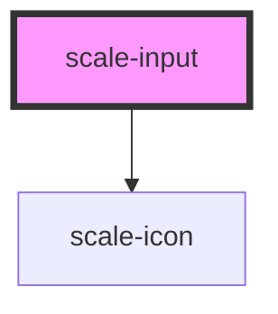

# scale-input

<!-- Auto Generated Below -->

## Properties

| Property      | Attribute      | Description                                                                               | Type                                                                                                                           | Default     |
| ------------- | -------------- | ----------------------------------------------------------------------------------------- | ------------------------------------------------------------------------------------------------------------------------------ | ----------- |
| `checked`     | `checked`      | (optional) Active switch                                                                  | `boolean`                                                                                                                      | `false`     |
| `cols`        | `cols`         | (optional) textarea column                                                                | `number`                                                                                                                       | `undefined` |
| `controlled`  | `controlled`   | (optional) Makes type `select` behave as a controlled component in React                  | `boolean`                                                                                                                      | `false`     |
| `counter`     | `counter`      | (optional) Input counter                                                                  | `boolean`                                                                                                                      | `undefined` |
| `dataQa`      | `data-qa`      | (optional) data-qa attribute for e2e testing                                              | `string`                                                                                                                       | `undefined` |
| `disabled`    | `disabled`     | (optional) Input disabled                                                                 | `boolean`                                                                                                                      | `undefined` |
| `helperText`  | `helper-text`  | (optional) Input helper text                                                              | `string`                                                                                                                       | `''`        |
| `icon`        | `icon`         | (optional) Input checkbox checked icon                                                    | `string`                                                                                                                       | `undefined` |
| `inputId`     | `input-id`     | (optional) Input checkbox id                                                              | `string`                                                                                                                       | `undefined` |
| `invalid`     | `invalid`      | (optional) Input status                                                                   | `boolean`                                                                                                                      | `false`     |
| `label`       | `label`        | (optional) Input label                                                                    | `string`                                                                                                                       | `''`        |
| `maxLength`   | `max-length`   | (optional) Input max length                                                               | `number`                                                                                                                       | `undefined` |
| `minLength`   | `min-length`   | (optional) Input min length                                                               | `number`                                                                                                                       | `undefined` |
| `multiple`    | `multiple`     | (optional) select multiple options                                                        | `boolean`                                                                                                                      | `undefined` |
| `name`        | `name`         | (optional) Input name                                                                     | `string`                                                                                                                       | `''`        |
| `placeholder` | `placeholder`  | (optional) Input placeHolder                                                              | `string`                                                                                                                       | `''`        |
| `required`    | `required`     | (optional) Input required                                                                 | `boolean`                                                                                                                      | `undefined` |
| `resize`      | `resize`       | (optional) textarea resize                                                                | `"horizontal" \| "none" \| "unset" \| "vertical"`                                                                              | `undefined` |
| `rows`        | `rows`         | (optional) textarea row                                                                   | `number`                                                                                                                       | `undefined` |
| `size`        | `size`         | (optional) Input size                                                                     | `string`                                                                                                                       | `''`        |
| `status`      | `status`       | **[DEPRECATED]** - invalid should replace status   | `string`                                                                                                                       | `''`        |
| `styles`      | `styles`       | (optional) Injected CSS styles                                                            | `string`                                                                                                                       | `undefined` |
| `transparent` | `transparent`  | (optional) input background transparent                                                   | `boolean`                                                                                                                      | `undefined` |
| `type`        | `type`         | (optional) Input type                                                                     | `"checkbox" \| "email" \| "hidden" \| "number" \| "password" \| "radio" \| "select" \| "tel" \| "text" \| "textarea" \| "url"` | `'text'`    |
| `value`       | `value`        | (optional) Input value                                                                    | `number \| string`                                                                                                             | `''`        |
| `variant`     | `variant`      | (optional) Input label variant                                                            | `"animated" \| "static"`                                                                                                       | `'static'`  |
| `visibleSize` | `visible-size` | (optional) the number of visible options in a select drop-down list                       | `number`                                                                                                                       | `undefined` |

## Events

| Event           | Description                             | Type                                  |
| --------------- | --------------------------------------- | ------------------------------------- |
| `scale-blur`    | Emitted when the input loses focus.     | `CustomEvent<void>`                   |
| `scale-change`  | Emitted when the value has changed.     | `CustomEvent<InputChangeEventDetail>` |
| `scale-focus`   | Emitted when the input has focus.       | `CustomEvent<void>`                   |
| `scale-input`   | Emitted when a keyboard input occurred. | `CustomEvent<KeyboardEvent>`          |
| `scale-keydown` | Emitted on keydown.                     | `CustomEvent<KeyboardEvent>`          |

## Dependencies

### Depends on

- [scale-icon](../icon)

### Graph

----------------------------------------------

*Built with [StencilJS](https://stenciljs.com/)*
