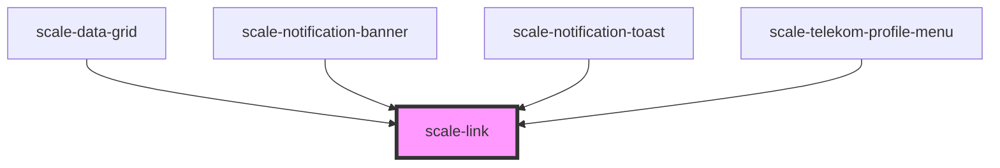

# scale-link

<!-- Auto Generated Below -->

## Overview

This is a superset of the default anchor `<a>` element.

## Usage

### Link

## Default

<scale-link href="http://example.com">
	Label
</scale-link>

## Target

<scale-link href="http://example.com" target="_blank">
	Label
</scale-link>

## Disabled

<scale-link href="http://example.com" disabled>
	Label
</scale-link>

## Block

<scale-link href="http://example.com" block="true">
	Label
</scale-link>

## No underline

<scale-link href="http://example.com" underline="false">
	Label
</scale-link>

## Icon

<scale-link href="http://example.com" icon="M23.55 9.4c-.25-.7-.85-1.2-1.6-1.25l-6-.45-2.25-5.55C13.4 1.45 12.75 1 12 1s-1.4.45-1.7 1.15L8 7.75 2 8.2c-.75.05-1.35.55-1.6 1.25s0 1.45.55 1.95l4.6 3.9-1.4 5.8c-.15.7.1 1.45.7 1.9.3.25.7.35 1.05.35.35 0 .65-.1.95-.25L12 19.9l5.1 3.2c.65.4 1.4.35 2-.05.6-.45.85-1.2.7-1.9l-1.45-5.85 4.6-3.9c.6-.55.85-1.3.6-2zm-1.5.8l-5.3 4.5 1.65 6.75c.05.2-.05.3-.1.35-.05.05-.2.1-.35 0L12 18.1l-5.9 3.65c-.15.1-.3.05-.35 0-.05-.05-.15-.15-.1-.35l1.65-6.75-5.3-4.5c-.15-.1-.1-.25-.1-.35 0-.05.1-.2.25-.2l6.95-.5 2.65-6.45c.05-.15.15-.15.25-.15s.2.05.3.2l2.65 6.45 6.95.5c.2 0 .25.15.25.2 0 .1 0 .25-.1.35z">
	Label
</scale-link>

## Icon size

<scale-link href="http://example.com" icon-size="16" icon="M23.55 9.4c-.25-.7-.85-1.2-1.6-1.25l-6-.45-2.25-5.55C13.4 1.45 12.75 1 12 1s-1.4.45-1.7 1.15L8 7.75 2 8.2c-.75.05-1.35.55-1.6 1.25s0 1.45.55 1.95l4.6 3.9-1.4 5.8c-.15.7.1 1.45.7 1.9.3.25.7.35 1.05.35.35 0 .65-.1.95-.25L12 19.9l5.1 3.2c.65.4 1.4.35 2-.05.6-.45.85-1.2.7-1.9l-1.45-5.85 4.6-3.9c.6-.55.85-1.3.6-2zm-1.5.8l-5.3 4.5 1.65 6.75c.05.2-.05.3-.1.35-.05.05-.2.1-.35 0L12 18.1l-5.9 3.65c-.15.1-.3.05-.35 0-.05-.05-.15-.15-.1-.35l1.65-6.75-5.3-4.5c-.15-.1-.1-.25-.1-.35 0-.05.1-.2.25-.2l6.95-.5 2.65-6.45c.05-.15.15-.15.25-.15s.2.05.3.2l2.65 6.45 6.95.5c.2 0 .25.15.25.2 0 .1 0 .25-.1.35z">
	Label
</scale-link>

## Properties

| Property         | Attribute        | Description                                                                                                                                                          | Type                                                                                                                                                                                     | Default     |
| ---------------- | ---------------- | -------------------------------------------------------------------------------------------------------------------------------------------------------------------- | ---------------------------------------------------------------------------------------------------------------------------------------------------------------------------------------- | ----------- |
| `disabled`       | `disabled`       | (optional) Disabled link                                                                                                                                             | `boolean`                                                                                                                                                                                | `false`     |
| `download`       | `download`       | (optional) Download declaration                                                                                                                                      | `string`                                                                                                                                                                                 | `undefined` |
| `href`           | `href`           | (optional) Link href                                                                                                                                                 | `string`                                                                                                                                                                                 | `undefined` |
| `hreflang`       | `hreflang`       | (optional)                                                                                                                                                           | `string`                                                                                                                                                                                 | `undefined` |
| `iconPosition`   | `icon-position`  | (optional) Chnage icon/content slot order                                                                                                                            | `"after" \| "before"`                                                                                                                                                                    | `'after'`   |
| `innerTabindex`  | `inner-tabindex` | (optional) Set `tabindex` in the inner button or link element                                                                                                        | `number`                                                                                                                                                                                 | `undefined` |
| `omitUnderline`  | `omit-underline` | (optional) Remove the initial line from the text (can also be achieved via `--line-thickness-initial: 0`) Remove the line for every state with `--line-thickness: 0` | `boolean`                                                                                                                                                                                | `false`     |
| `ping`           | `ping`           | (optional)                                                                                                                                                           | `string`                                                                                                                                                                                 | `undefined` |
| `referrerpolicy` | `referrerpolicy` | (optional)                                                                                                                                                           | `"" \| "no-referrer" \| "no-referrer-when-downgrade" \| "origin" \| "origin-when-cross-origin" \| "same-origin" \| "strict-origin" \| "strict-origin-when-cross-origin" \| "unsafe-url"` | `undefined` |
| `rel`            | `rel`            | (optional)                                                                                                                                                           | `string`                                                                                                                                                                                 | `undefined` |
| `styles`         | `styles`         | (optional) Injected CSS styles                                                                                                                                       | `string`                                                                                                                                                                                 | `undefined` |
| `target`         | `target`         | (optional)                                                                                                                                                           | `"_blank" \| "_parent" \| "_self" \| "_top"`                                                                                                                                             | `undefined` |
| `type`           | `type`           | (optional)                                                                                                                                                           | `string`                                                                                                                                                                                 | `undefined` |

## Methods

### `setFocus() => Promise<void>`

#### Returns

Type: `Promise<void>`

## Slots

| Slot        | Description                                                          |
| ----------- | -------------------------------------------------------------------- |
| `"default"` | here goes the actual text of the                                     |
| `"icon"`    | a slot that will not be underlined and which position can be changed |

## Shadow Parts

| Part        | Description                                          |
| ----------- | ---------------------------------------------------- |
| `"anchor"`  | the native achor element wrapping all contents       |
| `"content"` | a wrapper around the default slot with the underline |

## Dependencies

### Used by

 - [scale-data-grid](../data-grid)
 - [scale-notification-banner](../notification-banner)
 - [scale-notification-toast](../notification-toast)
 - [scale-telekom-profile-menu](../telekom/telekom-profile-menu)

### Graph

----------------------------------------------

*Built with [StencilJS](https://stenciljs.com/)*
