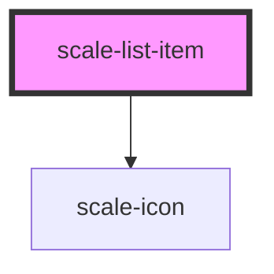

# scale-list

<!-- Auto Generated Below -->

## Properties

| Property  | Attribute | Description                    | Type                                     | Default       |
| --------- | --------- | ------------------------------ | ---------------------------------------- | ------------- |
| `styles`  | --        | (optional) Injected jss styles | `StyleSheet<string \| number \| symbol>` | `undefined`   |
| `variant` | `variant` |                                | `string`                                 | `'unordered'` |

---

# scale-list-item

<!-- Auto Generated Below -->

## Properties

| Property   | Attribute   | Description                     | Type                                     | Default     |
| ---------- | ----------- | ------------------------------- | ---------------------------------------- | ----------- |
| `icon`     | `icon`      | (optional) List item icon       | `string`                                 | `undefined` |
| `iconSize` | `icon-size` | (optional) list Icon size       | `number`                                 | `16`        |
| `styles`   | --          | (optional) Injected jss styles  | `StyleSheet<string \| number \| symbol>` | `undefined` |
| `type`     | `type`      | (optional) List item style type | `string`                                 | `undefined` |

## Dependencies

### Depends on

- [scale-icon](../icon)

### Graph

---

_Built with [StencilJS](https://stenciljs.com/)_
