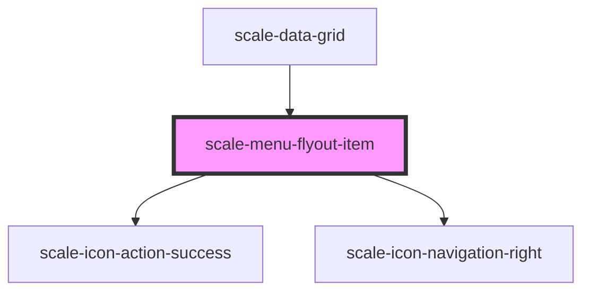

# scale-menu-flyout-item

<!-- Auto Generated Below -->

## Properties

| Property    | Attribute   | Description                                                                   | Type                    | Default     |
| ----------- | ----------- | ----------------------------------------------------------------------------- | ----------------------- | ----------- |
| `active`    | `active`    | (optional) Mark as active                                                     | `boolean`               | `false`     |
| `cascade`   | `cascade`   | (optional) Set to true to display arrow icon suffix                           | `boolean`               | `false`     |
| `checkable` | `checkable` | (optional) Whether the item should behave as a checkbox                       | `"checkbox" \| "radio"` | `undefined` |
| `checked`   | `checked`   | (optional) Set to true to display check prefix, false to display empty prefix | `boolean`               | `false`     |
| `disabled`  | `disabled`  | (optional) Disabled                                                           | `boolean`               | `false`     |
| `styles`    | `styles`    | (optional) Injected styles                                                    | `string`                | `undefined` |
| `value`     | `value`     | (optional) value                                                              | `string`                | `undefined` |

## Events

| Event          | Description                                                                                        | Type                                  |
| -------------- | -------------------------------------------------------------------------------------------------- | ------------------------------------- |
| `scale-select` | Event triggered when menu item selected                                                            | `CustomEvent<{ item: HTMLElement; }>` |
| `scaleSelect`  | **[DEPRECATED]** in v3 in favor of kebab-case event names   | `CustomEvent<{ item: HTMLElement; }>` |

## Methods

### `triggerEvent(event: KeyboardEvent | MouseEvent, closeOnSelect?: boolean) => Promise<void>`

#### Returns

Type: `Promise<void>`

## Shadow Parts

| Part       | Description |
| ---------- | ----------- |
| `"base"`   |             |
| `"label"`  |             |
| `"prefix"` |             |
| `"suffix"` |             |

## Dependencies

### Used by

 - [scale-data-grid](../data-grid)

### Depends on

- [scale-icon-action-success](../icons/action-success)
- [scale-icon-navigation-right](../icons/navigation-right)

### Graph

----------------------------------------------

*Built with [StencilJS](https://stenciljs.com/)*
