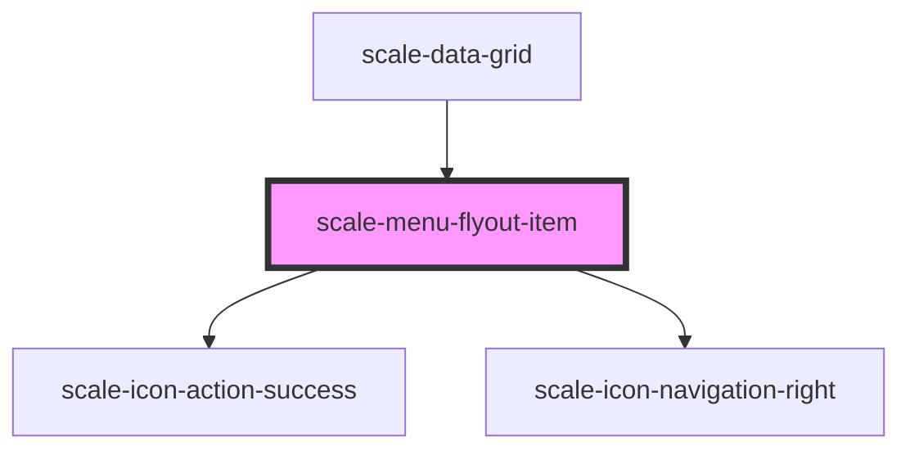

# scale-menu-flyout-item

<!-- Auto Generated Below -->

## Properties

| Property   | Attribute  | Description                                                                   | Type      | Default     |
| ---------- | ---------- | ----------------------------------------------------------------------------- | --------- | ----------- |
| `active`   | `active`   | (optional) Used by cascading menus to set when open                           | `boolean` | `false`     |
| `cascade`  | `cascade`  | (optional) Set to true to display arrow icon suffix                           | `boolean` | `false`     |
| `checked`  | `checked`  | (optional) Set to true to display check prefix, false to display empty prefix | `any`     | `undefined` |
| `disabled` | `disabled` | (optional) Disabled                                                           | `boolean` | `false`     |
| `value`    | `value`    | (optional) value                                                              | `string`  | `undefined` |

## Methods

### `removeFocus() => Promise<void>`

Removes the focus from the item

#### Returns

Type: `Promise<void>`

### `setFocus() => Promise<void>`

Sets the focus on the item

#### Returns

Type: `Promise<void>`

## Shadow Parts

| Part       | Description |
| ---------- | ----------- |
| `"base"`   |             |
| `"label"`  |             |
| `"prefix"` |             |
| `"suffix"` |             |

## Dependencies

### Used by

 - [scale-data-grid](../data-grid)

### Depends on

- [scale-icon-action-success](../icons/action-success)
- [scale-icon-navigation-right](../icons/navigation-right)

### Graph

----------------------------------------------

*Built with [StencilJS](https://stenciljs.com/)*
