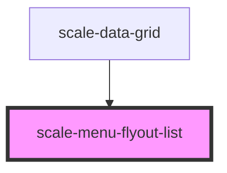

# scale-menu-flyout-list

<!-- Auto Generated Below -->

## Properties

| Property | Attribute | Description                | Type     | Default     |
| -------- | --------- | -------------------------- | -------- | ----------- |
| `styles` | `styles`  | (optional) Injected styles | `string` | `undefined` |

## Events

| Event          | Description                                                                                        | Type                                  |
| -------------- | -------------------------------------------------------------------------------------------------- | ------------------------------------- |
| `scale-select` | Event triggered every time the data is edited, changing original rows data                         | `CustomEvent<{ item: HTMLElement; }>` |
| `scaleSelect`  | **[DEPRECATED]** in v3 in favor of kebab-case event names   | `CustomEvent<{ item: HTMLElement; }>` |

## Methods

### `opened() => Promise<void>`

Menu calls this once opened and rendered

#### Returns

Type: `Promise<void>`

## Shadow Parts

| Part     | Description |
| -------- | ----------- |
| `"base"` |             |

## Dependencies

### Used by

 - [scale-data-grid](../data-grid)

### Graph

----------------------------------------------

*Built with [StencilJS](https://stenciljs.com/)*
