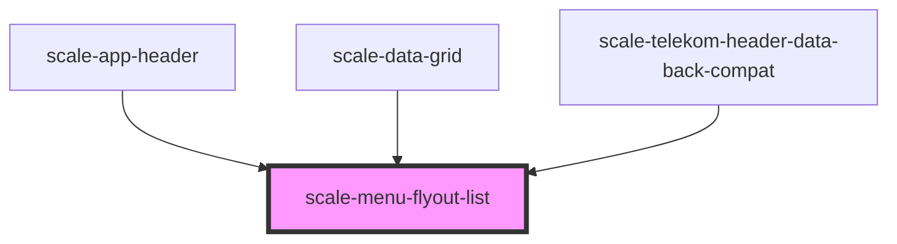

# scale-menu-flyout-list

<!-- Auto Generated Below -->

## Properties

| Property              | Attribute               | Description                                                                        | Type                                                                                | Default          |
| --------------------- | ----------------------- | ---------------------------------------------------------------------------------- | ----------------------------------------------------------------------------------- | ---------------- |
| `active`              | `active`                |                                                                                    | `boolean`                                                                           | `false`          |
| `brandHeaderDropdown` | `brand-header-dropdown` | (optional) set to true when using in telekom-brand-header                          | `boolean`                                                                           | `false`          |
| `closeOnSelect`       | `close-on-select`       | (optional) Determines whether the flyout should close when a menu item is selected | `boolean`                                                                           | `true`           |
| `direction`           | `direction`             | (optional) Set preference for where the menu appears, space permitting             | `"bottom-left" \| "bottom-right" \| "left" \| "right" \| "top-left" \| "top-right"` | `'bottom-right'` |
| `opened`              | `opened`                |                                                                                    | `boolean`                                                                           | `false`          |
| `styles`              | `styles`                | (optional) Injected styles                                                         | `string`                                                                            | `undefined`      |
| `trigger`             | --                      |                                                                                    | `() => HTMLElement`                                                                 | `undefined`      |

## Events

| Event         | Description                                                                                        | Type                                  |
| ------------- | -------------------------------------------------------------------------------------------------- | ------------------------------------- |
| `scale-close` | Event triggered when menu list closed                                                              | `CustomEvent<{ list: HTMLElement; }>` |
| `scale-open`  | Event triggered when menu list opened                                                              | `CustomEvent<{ list: HTMLElement; }>` |
| `scaleClose`  | **[DEPRECATED]** in v3 in favor of kebab-case event names   | `CustomEvent<{ list: HTMLElement; }>` |
| `scaleOpen`   | **[DEPRECATED]** in v3 in favor of kebab-case event names   | `CustomEvent<{ list: HTMLElement; }>` |

## Methods

### `close(silent?: boolean) => Promise<void>`

#### Returns

Type: `Promise<void>`

### `open() => Promise<void>`

#### Returns

Type: `Promise<void>`

### `setFocus() => Promise<void>`

#### Returns

Type: `Promise<void>`

## Shadow Parts

| Part     | Description |
| -------- | ----------- |
| `"base"` |             |

## Dependencies

### Used by

 - [scale-app-header](../telekom/app-header)
 - [scale-data-grid](../data-grid)
 - [scale-telekom-header-data-back-compat](../telekom/telekom-header-data-back-compat)

### Graph

----------------------------------------------

*Built with [StencilJS](https://stenciljs.com/)*
