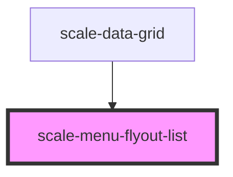

# scale-menu-flyout-list

<!-- Auto Generated Below -->

## Events

| Event         | Description                                                                | Type                                  |
| ------------- | -------------------------------------------------------------------------- | ------------------------------------- |
| `scaleSelect` | Event triggered every time the data is edited, changing original rows data | `CustomEvent<{ item: HTMLElement; }>` |

## Methods

### `opened() => Promise<void>`

Menu calls this once opened and rendered

#### Returns

Type: `Promise<void>`

## Shadow Parts

| Part     | Description |
| -------- | ----------- |
| `"base"` |             |

## Dependencies

### Used by

 - [scale-data-grid](../data-grid)

### Graph

----------------------------------------------

*Built with [StencilJS](https://stenciljs.com/)*
