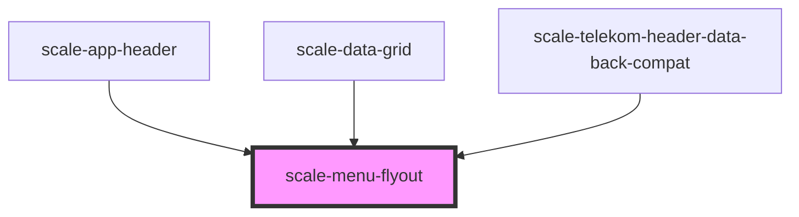

# scale-menu

<!-- Auto Generated Below -->

## Properties

| Property        | Attribute         | Description                                                                        | Type                                                                                | Default          |
| --------------- | ----------------- | ---------------------------------------------------------------------------------- | ----------------------------------------------------------------------------------- | ---------------- |
| `closeOnSelect` | `close-on-select` | (optional) Determines whether the flyout should close when a menu item is selected | `boolean`                                                                           | `true`           |
| `direction`     | `direction`       | (optional) Set preference for where the menu appears, space permitting             | `"bottom-left" \| "bottom-right" \| "left" \| "right" \| "top-left" \| "top-right"` | `'bottom-right'` |
| `styles`        | `styles`          | (optional) Injected styles                                                         | `string`                                                                            | `undefined`      |

## Shadow Parts

| Part        | Description |
| ----------- | ----------- |
| `"trigger"` |             |

## Dependencies

### Used by

 - [scale-app-header](../telekom/app-header)
 - [scale-data-grid](../data-grid)
 - [scale-telekom-header-data-back-compat](../telekom/telekom-header-data-back-compat)

### Graph

----------------------------------------------

*Built with [StencilJS](https://stenciljs.com/)*
