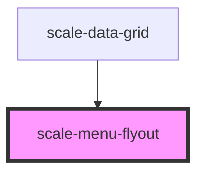

# scale-menu

<!-- Auto Generated Below -->

## Properties

| Property        | Attribute         | Description                                                                          | Type                                                                                | Default     |
| --------------- | ----------------- | ------------------------------------------------------------------------------------ | ----------------------------------------------------------------------------------- | ----------- |
| `closeOnSelect` | `close-on-select` | (optional) Determines whether the dropdown should close when a menu item is selected | `boolean`                                                                           | `true`      |
| `direction`     | `direction`       | (optional) Set preference for where the menu appears, space permitting               | `"bottom-left" \| "bottom-right" \| "left" \| "right" \| "top-left" \| "top-right"` | `undefined` |
| `open`          | `open`            | (optional) Tracks the menu list open state                                           | `boolean`                                                                           | `false`     |
| `styles`        | `styles`          | (optional) Injected styles                                                           | `string`                                                                            | `undefined` |

## Events

| Event          | Description                                                                                        | Type                                                 |
| -------------- | -------------------------------------------------------------------------------------------------- | ---------------------------------------------------- |
| `scale-close`  | Event triggered when menu list closed                                                              | `CustomEvent<{ id: number; cascadeLevel: number; }>` |
| `scale-open`   | Event triggered when menu list opened                                                              | `CustomEvent<{ id: number; cascadeLevel: number; }>` |
| `scale-select` | Event triggered when nested menu item selected                                                     | `CustomEvent<{ item: HTMLElement; }>`                |
| `scaleClose`   | **[DEPRECATED]** in v3 in favor of kebab-case event names   | `CustomEvent<{ id: number; cascadeLevel: number; }>` |
| `scaleOpen`    | **[DEPRECATED]** in v3 in favor of kebab-case event names   | `CustomEvent<{ id: number; cascadeLevel: number; }>` |
| `scaleSelect`  | **[DEPRECATED]** in v3 in favor of kebab-case event names   | `CustomEvent<{ item: HTMLElement; }>`                |

## Dependencies

### Used by

 - [scale-data-grid](../data-grid)

### Graph

----------------------------------------------

*Built with [StencilJS](https://stenciljs.com/)*
