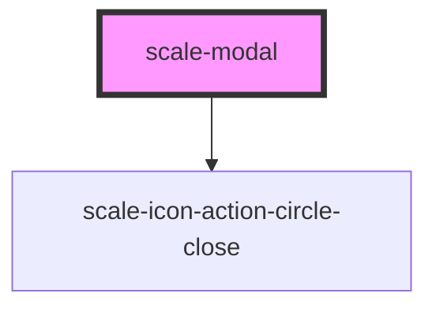

# scale-modal

<!-- Auto Generated Below -->

## Properties

| Property           | Attribute            | Description                              | Type                | Default          |
| ------------------ | -------------------- | ---------------------------------------- | ------------------- | ---------------- |
| `alignActions`     | `align-actions`      | (optional) Alignment of action buttons   | `"left" \| "right"` | `'right'`        |
| `closeButtonLabel` | `close-button-label` | (optional) Label for close button        | `string`            | `'Close Pop-up'` |
| `customClass`      | `custom-class`       | (optional) Custom class                  | `string`            | `''`             |
| `duration`         | `duration`           | (optional) Transition duration           | `number`            | `200`            |
| `heading`          | `heading`            | Modal heading                            | `string`            | `undefined`      |
| `opened`           | `opened`             | (optional) If `true`, the Modal is open. | `boolean`           | `false`          |
| `size`             | `size`               | (optional) Modal size                    | `string`            | `'default'`      |

## Events

| Event        | Description | Type               |
| ------------ | ----------- | ------------------ |
| `scaleClose` |             | `CustomEvent<any>` |
| `scaleOpen`  |             | `CustomEvent<any>` |

## Shadow Parts

| Part             | Description |
| ---------------- | ----------- |
| `"backdrop"`     |             |
| `"close-button"` |             |
| `"heading"`      |             |

## Dependencies

### Depends on

- [scale-icon-action-circle-close](../icons/action-circle-close)

### Graph

----------------------------------------------

*Built with [StencilJS](https://stenciljs.com/)*
