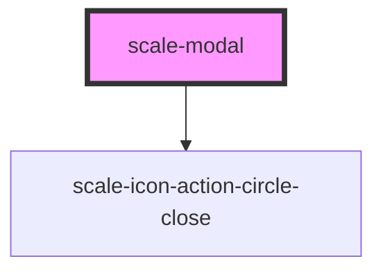

# scale-modal

<!-- Auto Generated Below -->

## Properties

| Property                    | Attribute                       | Description                                                                        | Type                | Default          |
| --------------------------- | ------------------------------- | ---------------------------------------------------------------------------------- | ------------------- | ---------------- |
| `alignActions`              | `align-actions`                 | (optional) Alignment of action buttons                                             | `"left" \| "right"` | `'right'`        |
| `allowInjectingStyleToBody` | `allow-injecting-style-to-body` | (optional) allow to inject css style {overflow: hidden} to body when modal is open | `boolean`           | `false`          |
| `closeButtonLabel`          | `close-button-label`            | (optional) Label for close button                                                  | `string`            | `'Close'` |
| `closeButtonTitle`          | `close-button-title`            | (optional) title for close button                                                  | `string`            | `'Close'`        |
| `duration`                  | `duration`                      | (optional) Transition duration                                                     | `number`            | `200`            |
| `heading`                   | `heading`                       | Modal heading                                                                      | `string`            | `undefined`      |
| `omitCloseButton`           | `omit-close-button`             | (optional) hide close button                                                       | `boolean`           | `false`          |
| `opened`                    | `opened`                        | (optional) If `true`, the Modal is open.                                           | `boolean`           | `false`          |
| `size`                      | `size`                          | (optional) Modal size                                                              | `string`            | `'default'`      |
| `styles`                    | `styles`                        | (optional) Injected CSS styles                                                     | `string`            | `undefined`      |

## Events

| Event                | Description                                                                                        | Type                                  |
| -------------------- | -------------------------------------------------------------------------------------------------- | ------------------------------------- |
| `scale-before-close` | Fires on every close attempt. Calling `event.preventDefault()` will prevent the modal from closing | `CustomEvent<BeforeCloseEventDetail>` |
| `scale-close`        | Fires when the modal has been closed                                                               | `CustomEvent<void>`                   |
| `scale-open`         | Fires when the modal has been opened                                                               | `CustomEvent<void>`                   |
| `scaleBeforeClose`   | **[DEPRECATED]** in v3 in favor of kebab-case event names   | `CustomEvent<BeforeCloseEventDetail>` |
| `scaleClose`         | **[DEPRECATED]** in v3 in favor of kebab-case event names   | `CustomEvent<void>`                   |
| `scaleOpen`          | **[DEPRECATED]** in v3 in favor of kebab-case event names   | `CustomEvent<void>`                   |

## Shadow Parts

| Part             | Description |
| ---------------- | ----------- |
| `"backdrop"`     |             |
| `"close-button"` |             |
| `"heading"`      |             |

## Dependencies

### Depends on

- [scale-icon-action-circle-close](../icons/action-circle-close)

### Graph

----------------------------------------------

*Built with [StencilJS](https://stenciljs.com/)*
